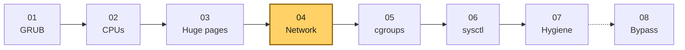
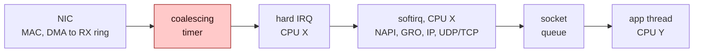
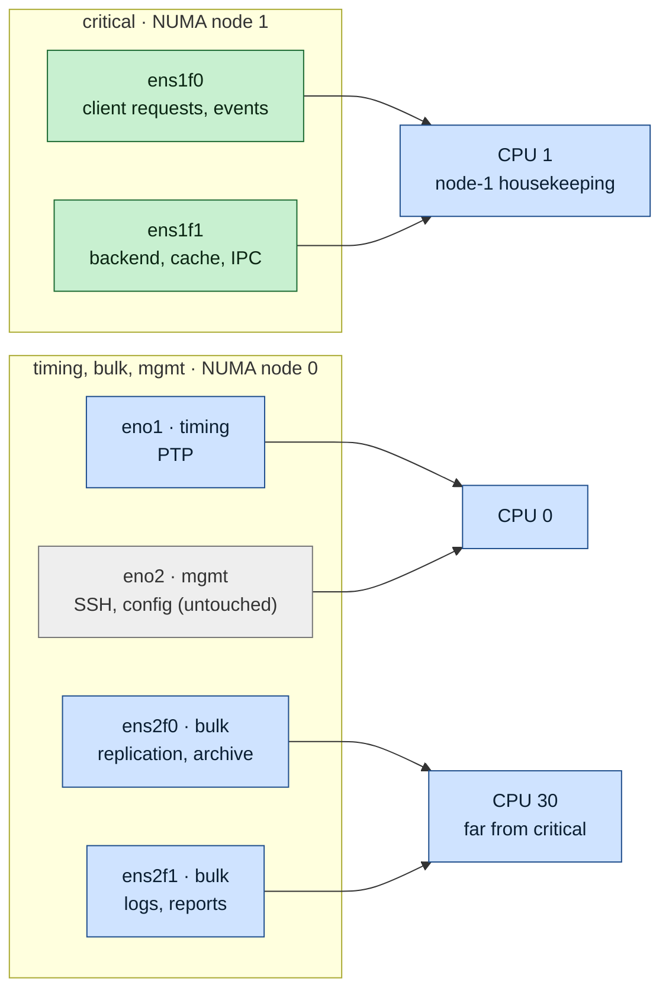
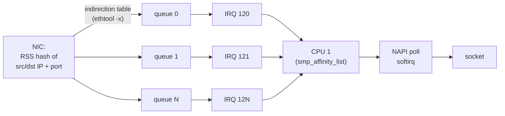
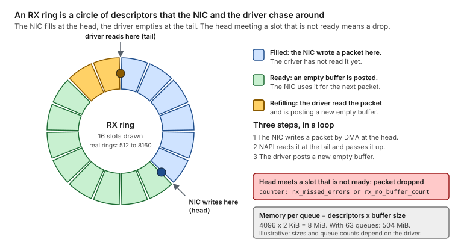
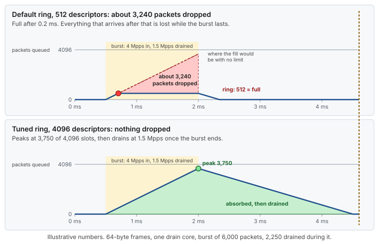
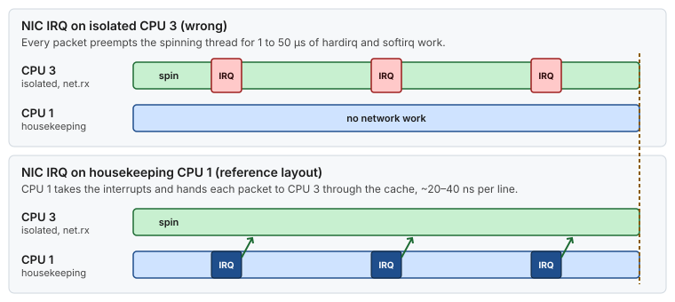
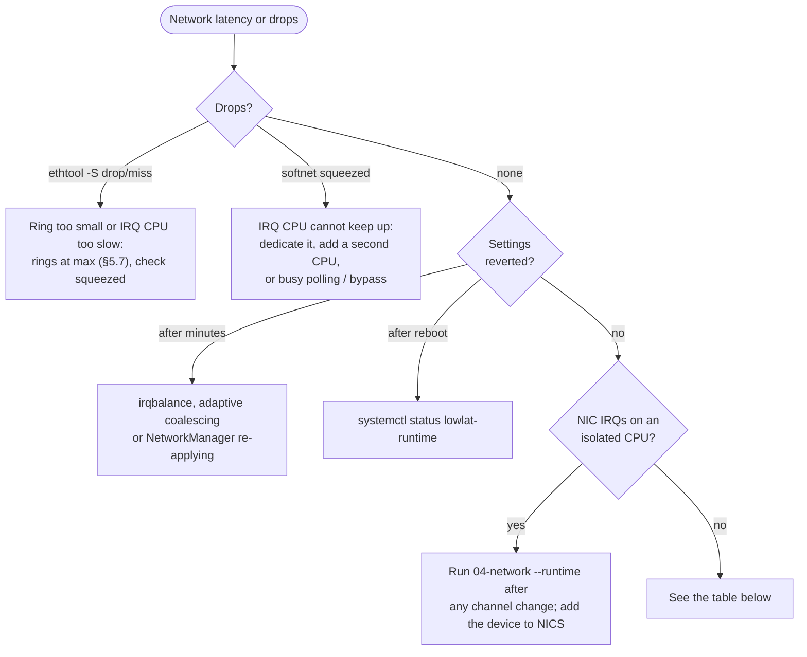

# Guide 04 — Network Optimization (NIC, Interrupts, Segmentation)

> **Script:** [`scripts/04-network`](../scripts/04-network) · **Concepts:** [network-tuning](../concepts/network-tuning.md), [ethtool reference](../concepts/ethtool.md) · **Example:** [examples/network-segmentation-example.md](../examples/network-segmentation-example.md) · **Previous:** [Guide 03](03-huge-pages-configuration.md) · **Next:** [Guide 05 — cgroups](05-cgroup-isolation.md) · **Terms:** [Glossary](../GLOSSARY.md)

| | |
|---|---|
| **Risk level** | **3 / 5**. All changes are runtime changes and are undone by a reboot, but changing queues or rings resets the NIC. On the wrong interface (the one you are SSH'd through), that is a short outage. |
| **Reboot required** | No. **Not persistent** either: re-applied at boot by `lowlat-runtime.service`. |
| **Applies to** | Bare metal: everything. VMs: coalescing/offloads where the virtual NIC supports them, and IRQ affinity for virtio/SR-IOV queues. |
| **Depends on** | [Guide 02](02-cpu-core-isolation.md) (CPU layout, irqbalance disabled) |

## At a glance

- **What:** give each traffic class its own NIC, then set every critical NIC so that a packet never waits (coalescing 0, no PAUSE, no batching offloads), is never dropped (large rings), and is handled on a known housekeeping CPU near the card.
- **Why:** adaptive coalescing alone adds 30–50 µs to the first packet of a burst, PAUSE frames stall a port for milliseconds, and one dropped TCP segment costs a 200 ms retransmit.
- **Cost:** one interrupt per packet on the IRQ CPU, lower bulk throughput unless you use the bulk profile, and a short link reset when queues or rings change.

**Time:** ~1 h (mostly discovery and the role map), no reboot · **Do this if:** kernel-stack NICs carry latency-critical traffic · **Skip if:** you're working on the management NIC you are logged in through (role `mgmt` is never tuned).



*Guide 04 uses the CPU layout from Guide 02 to decide where every NIC interrupt goes.*

---

## 1. Where network latency hides

A packet arriving on the wire goes through the following stages before the application reads it (details in [concepts/network-tuning.md](../concepts/network-tuning.md)):



*A received packet crosses six stages. The coalescing timer, highlighted, is where most of the avoidable waiting happens, and the IRQ CPU X is never the application's isolated CPU Y.*

Each stage has a setting that trades latency against throughput or CPU cost:

| Stage | Default behavior | Latency cost | Setting |
|---|---|---|---|
| Interrupt coalescing | Wait up to *N* µs, or *M* frames, before raising the IRQ. Often **adaptive**. | +10 to +100 µs per packet at low rates | `ethtool -C` |
| Receive aggregation (GRO/LRO) | Merge consecutive TCP segments | small, variable | `ethtool -K` |
| Transmit segmentation (TSO/GSO) | Build large frames and split them in the NIC or late in the stack | small, variable | `ethtool -K` |
| IRQ / softirq placement | irqbalance picks a CPU, possibly remote or isolated | cross-node cache misses; noise on the isolated CPU | `/proc/irq/N/smp_affinity_list` |
| Flow control | A congested peer can PAUSE our transmitter | up to ms | `ethtool -A` |
| Queue count / RSS | Driver default (often one per CPU) | queues on CPUs you did not choose; flows sharing a queue block each other | `ethtool -L`, `-X`, `-N` |
| Ring size | Driver default (typically 512 to 2048) | drops, then retransmits (TCP: ≥ 200 ms RTO) | `ethtool -G` |

The goal of this guide is that a critical packet **never waits** (coalescing 0, no batching, no PAUSE), is **never dropped** (large rings), and is **processed on a known CPU near the NIC** that is **not** one of the isolated CPUs.

## 2. When to apply

| Situation | Apply? |
|---|---|
| Physical NICs carrying latency-critical requests, event streams, or a latency-critical backend | **Yes** |
| Bulk links (replication, logs, reports) on the same host | Yes, with the *bulk* profile (§5.9) |
| The management interface you are logged in through | **No.** Role `mgmt` is never touched, except for moving its IRQs off isolated CPUs. |
| VMs with virtio/ENA/vmxnet3 | Partially: see §10 |
| Kernel-bypass NICs | Yes, for what the kernel keeps: one queue with socket acceleration, nothing with DPDK (§7, [Guide 08](08-kernel-bypass.md)). |

## 3. Network segmentation: give each traffic class its own NIC

Latency-critical traffic should never share a NIC, a queue, an IRQ, or a CPU with bulk traffic. A 50 MB log shipment in front of a 200-byte request is head-of-line blocking at every layer. The reference host uses **five roles**:



*Both critical NICs sit on node 1 and send their interrupts to CPU 1, the node's only housekeeping CPU. Timing and management interrupts go to CPU 0, and bulk interrupts to CPU 30, away from everything critical.*

<details>
<summary><b>The same host as text</b>, with link speeds</summary>

```text
                                 ┌──────────────────────── host ─────────────────────────┐
  Clients / peers     ══10/25G══►│ ens1f0  critical  (requests, events)      IRQ → CPU 1 │  NUMA node 1
  Internal services   ══10/25G══►│ ens1f1  critical  (backend, cache, IPC)   IRQ → CPU 1 │  (same card, same node
                                 │                                                        │   as the isolated CPUs)
  Grandmaster clock   ════1G════►│ eno1    timing    (PTP)                   IRQ → CPU 0 │  node 0
  Storage / replicas  ══10G═════►│ ens2f0  bulk      (replication, archive)  IRQ → CPU 30│  node 0
  Log/metrics sinks   ══10G═════►│ ens2f1  bulk      (logs, reports)         IRQ → CPU 30│
  Ops network         ════1G════►│ eno2    mgmt      (SSH, config mgmt)      IRQ → CPU 0 │  untouched
                                 └────────────────────────────────────────────────────────┘
```

</details>

| Role | Examples | Coalescing | Offloads | txqueuelen | IRQ CPUs |
|---|---|---|---|---|---|
| **critical** | client requests, event streams, critical backend | 0 µs, adaptive off | TSO/GSO/LRO off | default | node-local **housekeeping** CPU |
| **timing** | PTP (hardware timestamping) | 0 µs, adaptive off | off | default | housekeeping CPU |
| **bulk** | replication, logging, reports | 0 µs (reference) or 50–100 µs | off (reference) or on | **large** (300000 in the reference) | a CPU on the *other* node |
| **mgmt** | SSH, monitoring, config management | untouched | untouched | untouched | any housekeeping CPU |

In `lowlat.conf` the roles are one line per interface:

```bash
NICS=(
  "ens1f0|critical|1|0"          # name|role|irq_cpus|txqueuelen (0 = driver default)
  "ens1f1|critical|1|0"
  "eno1|timing|0|0"
  "ens2f0|bulk|30|300000"
  "ens2f1|bulk|30|300000"
  "eno2|mgmt|0|0"
)
```

The scripts never hard-code interface names. The naming scheme (`em1`/`p1p1` biosdevname, `eno1`/`ens1f0` predictable names) differs between vendors and can change with a kernel argument ([Guide 01 §5.7](01-grub-bootloader-tuning.md#57-miscellaneous)).

A full walkthrough, including routing, `tc`, and NetworkManager persistence, is in [examples/network-segmentation-example.md](../examples/network-segmentation-example.md).

## 4. Discovery

```bash
ip -br link                                            # names and state
ethtool -i ens1f0                                      # driver, firmware, PCI bus-info
cat /sys/class/net/ens1f0/device/numa_node             # which node the card is attached to
lspci -vv -s $(ethtool -i ens1f0 | awk '/bus-info/{print $2}') | grep -E 'LnkSta|NUMA'   # PCIe width/speed

ethtool -l ens1f0      # queues (channels): maximum vs current
ethtool -c ens1f0      # coalescing
ethtool -k ens1f0      # offload features
ethtool -a ens1f0      # pause frames
ethtool -g ens1f0      # ring sizes: maximum vs current
grep ens1f0 /proc/interrupts                           # IRQ per queue and which CPUs served them
```

What each of these options shows and changes is described in [concepts/ethtool.md](../concepts/ethtool.md).

Save this output **before** tuning (`scripts/04-network` has `show_nic_state <iface>` for a compact version). It is your rollback reference.

## 5. Per-NIC settings (`tune_nic_low_latency`)

For each `critical` and `timing` NIC, in this order (bulk NICs follow §5.9, `mgmt` NICs are skipped):

1. Queues: one per IRQ CPU (§5.1). **Resets the link.**
2. Adaptive coalescing off (§5.2), then coalescing 0 (§5.3).
3. PAUSE frames off (§5.4).
4. TSO, GSO and LRO off (§5.5). Checksum offload stays on (§5.6).
5. Rings at maximum (§5.7). **Resets the link.**
6. Place the IRQs (§6), always after steps 1 and 5.

### 5.1 Queues (channels): `ethtool -L`

A modern NIC is not one pipe. It is a set of **queues** (rings of packet descriptors), and each queue has its own **MSI-X interrupt vector**. `ethtool` calls a queue together with its interrupt a **channel**:

```
$ ethtool -l ens1f0
Channel parameters for ens1f0:
Pre-set maximums:            ← what the hardware/driver can do
RX:             0            ← RX-only queues with their own IRQ (0 = the driver does not use them)
TX:             0            ← TX-only queues with their own IRQ
Other:          1            ← link-state / management interrupt, never carries packets
Combined:       63           ← RX queue + TX queue sharing ONE interrupt vector
Current hardware settings:   ← what is configured now
RX:             0
TX:             0
Other:          1
Combined:       63           ← the driver default: often one per CPU, up to the maximum
```

Most current drivers (ixgbe, i40e, ice, mlx5, sfc, bnxt) only use `Combined`. `ethtool -L ens1f0 combined N` therefore means "use N queue pairs, and N interrupts". Where a packet goes:



*The NIC hashes each flow to a queue, each queue has its own MSI-X interrupt, and here every interrupt points at CPU 1. So one CPU drains all the queues in turn, which is why the queue count should follow the number of IRQ CPUs.*

The queue count matters in three places:

- **Parallelism.** Each queue is drained by the softirq of the CPU its IRQ lands on. N queues can be serviced by N CPUs in parallel, but only if their IRQs are spread over N CPUs.
- **Isolation between flows.** Two flows in the same queue are processed in order: a burst on one delays the other (head-of-line blocking). In different queues, on different CPUs, they do not.
- **Cost.** Each queue pins ring memory and packet buffers, adds an IRQ vector to place, and adds a NAPI context to poll.

#### Kernel stack: one queue per IRQ CPU

```bash
ethtool -L ens1f0 combined 1        # NICS entry "ens1f0|critical|1|0": one IRQ CPU → one queue
ethtool -L ens2f0 combined 2        # NICS entry "ens2f0|bulk|28,30|..." → two queues, one per CPU
```

The script sets `combined` to the **number of CPUs in the NIC's `irq_cpus` field** in `NICS`, capped at the hardware maximum.

The driver default (one queue per CPU, for example 63) makes sense when the IRQs are spread over every CPU. This guide deliberately puts all of a NIC's interrupts on one or two housekeeping CPUs (§6), because on a low-latency host they must not land on isolated CPUs. With 63 queues whose IRQs all point at CPU 1:

- CPU 1 still processes every packet, one queue after the other, so there is no parallelism;
- the flows still share one softirq loop, so there is no isolation;
- the host pays for 63 rings, 63 vectors and 63 NAPI contexts;
- after a driver reset, 62 more IRQs can reappear on the wrong CPUs.

So on a kernel-stack host the queue count follows the CPU budget: **add IRQ CPUs first, then queues**.

If one flow must never queue behind the others, put it in its own queue with its own CPU, and steer it there with an **ntuple rule**. The rule overrides RSS for matching packets:

```bash
ethtool -K ens1f0 ntuple on
ethtool -L ens1f0 combined 2                                        # queue 0: critical flow, queue 1: everything else
ethtool -X ens1f0 weight 0 1                                        # RSS spreads hashed traffic to queue 1 only
ethtool -N ens1f0 flow-type udp4 dst-ip 10.10.1.10 dst-port 5000 action 0   # the critical flow → queue 0
ethtool -n ens1f0                                                   # list the rules
# then place queue 0's IRQ on one housekeeping CPU and queue 1's IRQ on another (§6)
```

ntuple support and the fields you can match on depend on the driver (`ethtool -k ens1f0 | grep ntuple`). The full option reference is in [concepts/ethtool.md](../concepts/ethtool.md).

#### Kernel bypass: it depends on the stack

`combined 1` on a kernel-bypass NIC is correct for socket-acceleration stacks such as **OpenOnload on Solarflare** (and XLIO on NVIDIA). The bypass stack creates **its own** hardware queues for the accelerated sockets, so the kernel queues carry only the traffic Onload does not accelerate (ARP, ICMP, unaccelerated sockets). One queue is enough for that; more would only add IRQs to place and memory to pin.

With **DPDK on an Intel card** the question disappears: the port is unbound from the kernel driver and `ethtool` no longer sees it. [Guide 08 — Kernel bypass](08-kernel-bypass.md) covers each stack.

In `lowlat.conf`, `KERNEL_BYPASS_DRIVER` and `KERNEL_BYPASS_COMMAND` mark socket-acceleration NICs. The script gives those NICs one queue, whatever their `irq_cpus` field says.

> [!WARNING]
> **Changing channels resets the NIC** on most drivers (link down for 1–3 s), and the new queues come up with **default IRQ affinity**. Do it at boot or in a maintenance window, never under live traffic, and always re-run the IRQ placement (§6) afterwards. `apply-all` and `lowlat-runtime.service` already run the two steps in that order.

### 5.2 Adaptive coalescing off: `ethtool -C adaptive-rx off adaptive-tx off`

Adaptive (DIM) coalescing re-tunes `rx-usecs` continuously from the observed packet rate. It is excellent for throughput and CPU usage, and it is the reason a quiet link suddenly adds 30–50 µs when a burst starts. It also **overwrites** fixed values, so it must be off before §5.3 means anything.

### 5.3 Coalescing 0: `ethtool -C rx-usecs 0 tx-usecs 0`

`rx-usecs` is how long the NIC waits after the first packet before raising the interrupt, hoping to batch more. `0` means **interrupt immediately**.



*With coalescing, the first packet of a burst sits in the NIC until the timer expires. With `rx-usecs 0`, it raises the interrupt at once.*

| rx-usecs | Latency added at low rate | Interrupt rate at 1 Mpps |
|---|---|---|
| 0 | ~0 | up to 1 M/s (the CPU handling the IRQs must keep up) |
| 8 | ≤ 8 µs | ≤ 125 k/s |
| 50 | ≤ 50 µs | ≤ 20 k/s |
| adaptive | 0–100+ µs, varying | varies |

`tx-usecs 0` does the same for TX completions, so the TX ring is cleaned promptly and never fills. Some drivers also have `rx-frames`/`tx-frames`. If `ethtool -c` shows them, set them to `1` (or `0` where the driver documents that as "disabled").

The cost is CPU: every packet raises an interrupt on the housekeeping CPU. That CPU must not be one of the isolated ones (§6), and it should be **dedicated** to the critical NICs' interrupts on a busy host.

### 5.4 Pause frames off: `ethtool -A autoneg off rx off tx off`

This is **flow control** (IEEE 802.3x PAUSE), not an offload. With RX pause on, a peer or switch whose buffers are filling can tell our NIC to **stop transmitting** for up to 65,535 quanta: about 3.3 ms at 10 GbE and 0.3 ms at 100 GbE. For low-latency traffic a drop, handled by the protocol, is preferable to a silent multi-millisecond stall of *all* traffic on the port. Make sure the switch port is configured the same way. Priority flow control (PFC, for RoCE) is a separate topic and should not be disabled blindly on RDMA fabrics.

### 5.5 Segmentation and aggregation offloads off: `ethtool -K tso off gso off lro off`

| Feature | Direction | What it does | Why off |
|---|---|---|---|
| TSO | TX | NIC splits a large TCP buffer into MSS-sized segments | Encourages the stack to build large buffers; small writes may wait |
| GSO | TX | Same, done in software late in the stack | Same |
| LRO | RX | NIC merges segments into one large packet (not in routing/bridging setups) | Adds merge delay, and hides per-packet timing |

**GRO** (software receive aggregation) is left on by the reference configuration, because it only merges packets that arrive in the same NAPI poll. With coalescing 0 there is rarely more than one packet per poll. If you see GRO in latency traces, add `gro off` for critical NICs.

### 5.6 Checksum offload: keep it on, unless you have measured otherwise

`ethtool -K rx off tx off` disables **checksum offload** and moves checksum computation to the CPU. Some tuning scripts do this together with the offloads above. It is **not** a general latency win: the NIC computes checksums at line rate for free, while the CPU spends cycles on every byte. The only cases where turning it off makes sense are specific NIC/driver bugs, or packet-capture setups that need the raw checksum. It is therefore **opt-in** here (`NIC_DISABLE_CSUM_OFFLOAD=yes`).

### 5.7 Ring sizes at maximum: `ethtool -G rx <max> tx <max>`

The RX ring is where the NIC DMAs packets before software picks them up. If a burst (a traffic spike, a reconnect storm, a GC-less but busy consumer) arrives faster than NAPI drains it, packets are **dropped in hardware**, and a dropped TCP segment costs a retransmit timeout of ≥ 200 ms. A larger ring does not add latency while it is empty. It only absorbs bursts. Watch `ethtool -S <iface> | grep -iE 'drop|miss|fifo|no_buf'`.



*The NIC fills slots at the head and the driver empties them at the tail. A drop is the head meeting a slot that is not ready.*



*The same illustrative burst hits a default ring and a maximum ring. The small ring overflows in 0.2 ms, and the large one holds the whole burst.*

The time a ring buys you is its size divided by (arrival rate minus drain rate). [Concept: network buffers](../concepts/network-buffers.md) works this out with numbers, and shows how to tell a full ring from a full socket buffer.

### 5.8 `txqueuelen` (bulk NICs)

`txqueuelen` is the length of the **qdisc queue** in front of the TX ring (default 1000 packets). The reference configuration leaves critical NICs at the default and raises bulk NICs to **300000**, so that large replication or log bursts are queued instead of dropped at the qdisc.

It has nothing to do with `net.core.netdev_max_backlog`, which is an **RX-side** per-CPU queue between the driver and the protocol stack ([Guide 06](06-kernel-sysctl-tuning.md)). Some scripts claim the two "must be equal"; they don't.

### 5.9 Bulk profile

The reference configuration applies coalescing 0 to *all* non-management NICs, which keeps the rules simple. On hosts where the bulk links are busy, set `NIC_BULK_COALESCE_USECS=50` (or re-enable adaptive coalescing) to cut the interrupt load on the CPU that serves them. Bulk IRQs go to a CPU on the **other** NUMA node, so they compete neither with the critical IRQs nor with the isolated CPUs.

### 5.10 Do not bounce the link

`ethtool -L` and `-G` already reset the queues inside the driver. There is no need for `ifdown`/`ifup`, which relies on legacy network-scripts that were removed in RHEL 9. If a profile change needs re-applying, use `nmcli device reapply <iface>`, and never on the interface you are connected through.

## 6. Interrupt affinity (`set_nic_irq_affinity`)

### 6.1 Choosing the CPU

Where the NIC interrupt runs is where the **softirq** (protocol processing) runs. There are three models:

| Model | IRQ + softirq on | App thread | Pros | Cons |
|---|---|---|---|---|
| **A. Housekeeping IRQ CPU** (reference) | a node-local, non-isolated CPU (CPU 1) | isolated CPU, spins on the socket (non-blocking `recv` in a loop) | Isolated CPU never interrupted. Deterministic. | One cache-line transfer (same node, ~40–80 ns) from CPU 1 to the app CPU per packet |
| **B. Busy polling** | NAPI is polled **from the app thread's syscall** (`SO_BUSY_POLL`, `net.core.busy_read`) | isolated CPU | Skips the IRQ → softirq → wake-up chain | CPU cost; the IRQ still fires unless deferred (`napi_defer_hard_irqs`) |
| **C. Kernel bypass** (§7, [Guide 08](08-kernel-bypass.md)) | none for data (user space polls the NIC) | isolated CPU | Lowest latency, no syscalls | Vendor stack, own tuning, huge pages |



*Model A: the interrupt work goes to housekeeping CPU 1, so the isolated CPU only ever runs its spinning thread.*

> [!WARNING]
> Never put the IRQs of a kernel-stack NIC **on an isolated CPU** that runs a spinning thread. The softirq then has to preempt your thread (or waits in `ksoftirqd` behind it, see [Guide 02 §6.5](02-cpu-core-isolation.md#65-real-time-scheduling-class-usually-unnecessary)).

Rules for the reference host:

- critical NICs (node 1) → **CPU 1**, the node-1 housekeeping CPU;
- timing/management NICs → CPU 0;
- bulk NICs → CPU 30 (node 0, away from everything critical).

### 6.2 How the script finds and moves the IRQs

```bash
ls /sys/class/net/ens1f0/device/msi_irqs          # exact list of the PCI function's MSI-X vectors
echo 1 > /proc/irq/<irq>/smp_affinity_list         # CPU list format, no hex masks
cat /proc/irq/<irq>/effective_affinity_list        # what the interrupt controller actually uses
```

- The MSI-X directory lists **exactly** the vectors of that PCI function. The fallback, matching names in `/proc/interrupts`, uses whole-word matching, so that `em1` does not also match `em10`, a bug that affects scripts using `grep em1`.
- `smp_affinity_list` takes a CPU list (`1`, `0-3`, `1,3`), so there is no hex-mask arithmetic that silently breaks above 64 CPUs.
- With a multi-CPU list, most interrupt controllers (x86 APIC in physical mode) deliver to **one** CPU of the set. Check `effective_affinity_list`.
- Some drivers on newer kernels use **kernel-managed** IRQs, whose affinity is fixed and `write` fails with `EIO`. The script logs these and continues. For those drivers, reduce the queue count (§5.1) so the managed spreading only covers housekeeping CPUs, or use `isolcpus=managed_irq,...` ([Guide 01](01-grub-bootloader-tuning.md)).

> [!IMPORTANT]
> **irqbalance must be off** ([Guide 02 §4.3](02-cpu-core-isolation.md#43-irqbalance-persistent)), or it will rewrite these files within 10 seconds.

### 6.3 RPS, RFS and XPS

- **RPS/RFS** (software steering of receive processing to another CPU through an IPI): **off** (`rps_cpus = 0`, the default) for critical NICs. It adds an IPI and a cross-CPU hop.
- **XPS** (TX queue selection by sending CPU): map each isolated CPU that sends to one TX queue whose completion IRQ is on the housekeeping CPU, for example `echo 2a > /sys/class/net/ens1f0/queues/tx-0/xps_cpus`. This avoids TX-queue lock contention between threads. It is optional, and it is useful when several pinned threads send on the same NIC.

## 7. Kernel bypass (optional)

A kernel-bypass stack takes the data path of a NIC out of the kernel. The application polls the NIC's queues from user space, with no interrupt, no softirq and no syscall. One-way latency drops from roughly 5–10 µs (tuned kernel stack) to roughly 1–2 µs. This guide still applies to what the kernel keeps, but some of its settings change:

| Area | Kernel stack (this guide) | Socket acceleration (Onload, XLIO) | DPDK on Intel |
|---|---|---|---|
| Kernel queues (`ethtool -L`) | one per IRQ CPU (§5.1) | **1**: the stack has its own queues | n/a: the port has left the kernel |
| IRQ placement (§6) | yes | yes, for the one remaining queue | n/a |
| Coalescing / offloads (§5) | yes | kernel queue only; the stack has its own settings | n/a: poll-mode driver |
| Huge pages | optional | **required**, the stack must fail without them | **required** |
| Application change | none | none (`LD_PRELOAD` launcher) | rewrite against DPDK |

Everything else (choosing a stack, drivers, profiles, IOMMU, launch, verification and rollback) is in **[Guide 08 — Kernel bypass](08-kernel-bypass.md)**.

## 8. Persistence

Nothing in this guide survives a reboot or a driver reload. Two supported ways to re-apply it:

**A. Oneshot unit (default, used by `apply-all`)**: `scripts/systemd/lowlat-runtime.service` runs after `network-online.target` and calls `04-network --runtime` (and the other runtime parts). One script, one place, and it reads the same `lowlat.conf`.

**B. NetworkManager `ethtool.*` properties (RHEL 9)**: NetworkManager applies them every time the connection comes up, including after a link flap.

> [!NOTE]
> **Not proven in production.** The reference hosts use option A. Option B follows the NetworkManager documentation.


```bash
nmcli connection modify ens1f0 \
  ethtool.coalesce-adaptive-rx off ethtool.coalesce-adaptive-tx off \
  ethtool.coalesce-rx-usecs 0 ethtool.coalesce-tx-usecs 0 \
  ethtool.pause-autoneg off ethtool.pause-rx off ethtool.pause-tx off \
  ethtool.feature-tso off ethtool.feature-gso off ethtool.feature-lro off \
  ethtool.ring-rx 4096 ethtool.ring-tx 4096
nmcli connection up ens1f0        # maintenance window: re-activates the link
```

Channel counts (`ethtool.channels-combined`) need a recent NetworkManager (≥ 1.36). IRQ affinity is not a NetworkManager property, so keep the oneshot unit for it. `/etc/rc.d/rc.local` also works, but it is a legacy mechanism with no ordering guarantees and no status in `systemctl`.

## 9. Verification

```bash
scripts/04-network --verify             # per-NIC PASS/FAIL, and "no NIC IRQ on an isolated CPU"
. scripts/04-network && show_nic_state ens1f0

# Interrupts: the critical NIC's counters increase only in the CPU1 column
watch -d -n1 "grep -E 'CPU|ens1f0' /proc/interrupts"

# Drops: hardware, driver, and per-CPU backlog
ethtool -S ens1f0 | grep -iE 'drop|miss|discard|no_buf|fifo' | grep -v ': 0$'
awk '{printf "cpu%-3d processed=%d dropped=%d squeezed=%d\n", NR-1, strtonum("0x"$1), strtonum("0x"$2), strtonum("0x"$3)}' /proc/net/softnet_stat
nstat -az | grep -E 'UdpRcvbufErrors|TcpExtListenDrops|TcpExtTCPBacklogDrop'

# Round-trip latency between two tuned hosts (sockperf is in EPEL)
sockperf server -i <ip> -p 11111 --tcp            # on host B (pinned: taskset -c 9)
sockperf ping-pong -i <ip> -p 11111 --tcp -t 30 --full-rtt   # on host A (taskset -c 9)
```

Record p50/p99/p99.9 before and after. The biggest visible change is usually in p99 and above, where adaptive coalescing and PAUSE frames lived.

## 10. Bare metal vs VM

| | Bare metal | VM |
|---|---|---|
| Coalescing 0, adaptive off | ✅ | ⚠️ virtio: `ethtool -C` is supported on recent kernels; ENA/vmxnet3: partial. Try it and check `ethtool -c`. |
| Offloads off | ✅ | ✅ |
| Pause frames | ✅ | ❌ not applicable (the host owns the physical port) |
| Rings / channels | ✅ | ⚠️ limited by the virtual device |
| IRQ affinity | ✅ | ✅ for virtio/SR-IOV queues. irqbalance stays **on** in VMs (Guide 02 keeps it), so either ban CPUs in its config or accept that it moves IRQs. |
| Kernel bypass | ✅ | Only with SR-IOV VF passthrough of a supported NIC |
| Best VM option | — | Ask for **SR-IOV / passthrough** of the critical NIC, plus vCPU pinning on the host |

## 11. Troubleshooting



*Check drops first, then whether settings survived, then where the interrupts land. Each branch ends at the fix from the table.*

| Symptom | Cause | Fix |
|---|---|---|
| `ethtool -C` → *Operation not supported* | Driver does not implement that parameter | Check `ethtool -c` for supported keys; skip it |
| Settings revert after a few minutes | irqbalance (IRQ), adaptive coalescing (usecs), NetworkManager re-applying a profile | Disable irqbalance; `adaptive-rx off`; put the values in the NM profile |
| Settings gone after reboot/link flap | Runtime-only | `systemctl status lowlat-runtime`; NM `ethtool.*` properties |
| IRQ affinity write fails with *Input/output error* | Kernel-managed IRQ | §6.2 |
| Interrupt counts rise on an isolated CPU | IRQ not placed (new queue after `ethtool -L`, or a device not in `NICS`) | Run `04-network --runtime` after any channel change; add the device |
| `softnet_stat` squeezed column increasing | The IRQ CPU cannot keep up (coalescing 0 at a high packet rate) | Dedicate that CPU to IRQs, spread the queues over two housekeeping CPUs, or use busy polling / bypass |
| Latency better but throughput collapsed on bulk NIC | Coalescing 0 + offloads off at a high rate | §5.9 bulk profile |
| SSH session dropped while applying | `ethtool -L`/`-G` on the management NIC | Mark it `mgmt` in `NICS` |

When verifying a configured IRQ CPU list, the script requires at least one
IRQ and a readable affinity value for every discovered vector. An empty
IRQ list is a FAIL. Virtio PCI NICs expose their vectors on the PCI parent
of the virtio device, rather than directly under the interface's `device`
directory. The script checks that parent and checks effective affinity when
the kernel provides it. If verification fails, compare the requested
`smp_affinity_list` with `effective_affinity_list` under `/proc/irq/<irq>`;
kernel-managed vectors may reject manual placement.

## 12. Rollback

**Whole host:**

- [ ] Stop re-applying at boot: `sudo systemctl disable lowlat-runtime.service`
- [ ] Re-enable irqbalance: `sudo systemctl enable --now irqbalance`
- [ ] Reboot, so the drivers load with their defaults: `sudo systemctl reboot`

**One interface, without a reboot:**

- [ ] Adaptive coalescing on: `sudo ethtool -C ens1f0 adaptive-rx on adaptive-tx on`
- [ ] Offloads on: `sudo ethtool -K ens1f0 tso on gso on`
- [ ] PAUSE on: `sudo ethtool -A ens1f0 autoneg on rx on tx on`
- [ ] Queue count back to the "Current" value you saved in §4 (resets the link): `sudo ethtool -L ens1f0 combined <n>`
- [ ] RSS indirection back to the driver default: `sudo ethtool -X ens1f0 default`
- [ ] Every ntuple rule listed by `ethtool -n`: `sudo ethtool -N ens1f0 delete <rule id>`

## 13. Key takeaways

- One traffic class per NIC. Critical traffic never shares a NIC, queue, IRQ or CPU with bulk.
- Critical NICs: adaptive coalescing off, then `rx-usecs 0`; PAUSE off; TSO/GSO/LRO off; rings at maximum; checksum offload on.
- On the kernel stack, one queue per IRQ CPU. Add IRQ CPUs first, then queues.
- NIC interrupts go to a node-local housekeeping CPU, never an isolated one, and irqbalance stays off.
- Nothing here is persistent. `lowlat-runtime.service` re-applies it at every boot, in the right order.

## 14. References

- `man 8 ethtool`; kernel networking scaling: <https://docs.kernel.org/networking/scaling.html>
- NAPI and busy polling: <https://docs.kernel.org/networking/napi.html>
- Red Hat — *Tuning the network performance* (RHEL 9), *nm-settings-nmcli(5)* `ethtool` section
- Deep dive: [concepts/network-tuning.md](../concepts/network-tuning.md); every `ethtool` option: [concepts/ethtool.md](../concepts/ethtool.md)
- Kernel bypass: [Guide 08](08-kernel-bypass.md)
