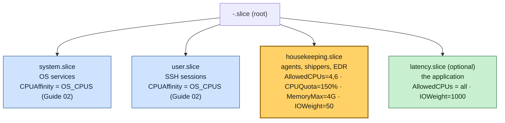
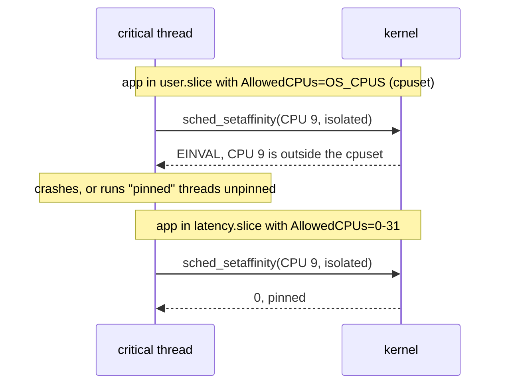
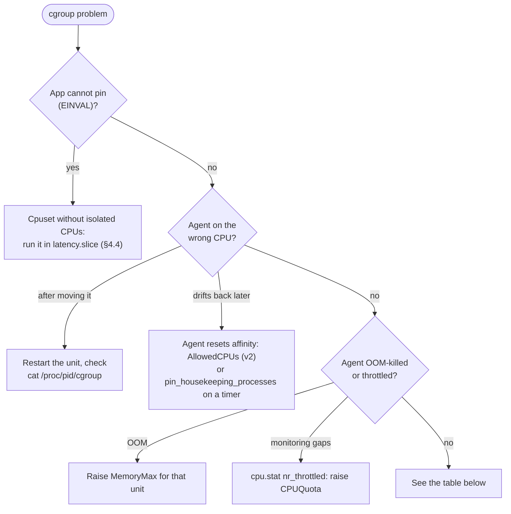

# Guide 05 — Process Isolation with cgroups and systemd Slices

> **Script:** [`scripts/05-cgroup-isolation`](../scripts/05-cgroup-isolation) · **Concept:** [concepts/cgroups.md](../concepts/cgroups.md) · **Previous:** [Guide 04](04-network-optimization.md) · **Next:** [Guide 06 — Kernel sysctl](06-kernel-sysctl-tuning.md) · **Terms:** [Glossary](../GLOSSARY.md)

| | |
|---|---|
| **Risk level** | **3 / 5**. A wrong cpuset can prevent the application from pinning its threads, and a tight memory limit can OOM-kill an agent you need (monitoring, security). |
| **Reboot required** | No. Restart the services that were moved into the slice. |
| **Applies to** | Bare metal and VMs (resource limits are useful everywhere; CPU fencing matters most on bare metal). |
| **Depends on** | [Guide 02](02-cpu-core-isolation.md) (CPU layout, systemd `CPUAffinity`) |

## At a glance

- **What:** put agents (EDR, log shippers, exporters, backup) into a `housekeeping.slice` that fences them onto two quiet CPUs and caps their CPU, memory and I/O.
- **Why:** affinity is advisory, and agents reset it. A hard cpuset fence plus quotas keeps a misbehaving agent away from isolated CPUs and away from the CPU that serves the critical NIC.
- **Cost:** agents get less headroom and may report "degraded". A cpuset on the wrong slice can stop the application from pinning.

**Time:** ~30 min, no reboot (restart the moved services) · **Do this if:** third-party agents run next to the application · **Skip if:** the host runs no agents at all (Guide 02 is enough).


*Guide 05 hardens what Guide 02 set up: affinity becomes a fence for the processes that do not respect it.*

---

## 1. What this guide adds on top of Guide 02

[Guide 02](02-cpu-core-isolation.md) already moves every service off the isolated CPUs, through systemd's `CPUAffinity`. That is affinity, which is **advisory**: any process may call `sched_setaffinity()` and move itself. Two classes of process make that insufficient:

1. **Agents that set their own affinity or spawn processes outside systemd**: endpoint security (EDR/antivirus), some monitoring and backup agents, vendor tools started from their own init scripts. They can end up anywhere, including on an isolated CPU or on the CPU that serves the critical NIC's interrupts.
2. **Agents that misbehave under load**: a log shipper that reads 2 GB of backlog after a network blip, or a scanner walking the filesystem. They do not need an isolated CPU to hurt you. Saturating the **housekeeping** CPUs (where NIC IRQs and softirqs run), filling the page cache, or hammering the disk is enough.


*The same three bursts, two placements. Sharing the critical CPU stalls the thread every time. The fence sends the bursts elsewhere.*

cgroups solve both. A **cpuset** is a hard fence (a process cannot leave it). The **cpu, memory and io controllers** cap what the processes inside can consume. systemd exposes all of it through **slices**, so you never touch `/sys/fs/cgroup` by hand.

## 2. When to apply

| Situation | Apply |
|---|---|
| Host runs security/monitoring/logging agents next to the latency-critical application | **Yes.** This is the main use case. |
| An agent was observed on an isolated or IRQ CPU (`ps -eLo psr,comm`) | **Yes**, plus `pin_housekeeping_processes` |
| Multi-tenant host (several applications) | **Yes.** One slice per tenant with `AllowedCPUs`, `MemoryMax`, `IOWeight`. |
| VM | Yes, for resource limits. CPU fencing still limits noise inside the guest. |
| Host with no third-party agents | Optional. Guide 02 is sufficient. |

## 3. cgroup v1 or v2?

```bash
stat -fc %T /sys/fs/cgroup        # cgroup2fs = v2 (RHEL 9 default); tmpfs = v1 (RHEL 8 default)
```

| | cgroup v1 (RHEL 8 default) | cgroup v2 (RHEL 9 default) |
|---|---|---|
| Hierarchy | one tree per controller | one unified tree |
| CPU fence in systemd | ❌ no `AllowedCPUs` (systemd 239); use `CPUAffinity=` per unit | ✅ `AllowedCPUs=` on a slice or unit |
| Memory cap | `MemoryLimit=` | `MemoryMax=`, `MemoryHigh=`, `MemorySwapMax=` |
| I/O share | `BlockIOWeight=` | `IOWeight=`, `IOReadBandwidthMax=`, `IOWriteBandwidthMax=` |
| CPU cap | `CPUQuota=` | `CPUQuota=`, `CPUWeight=` |

RHEL 8 can boot into v2 with the kernel argument `systemd.unified_cgroup_hierarchy=1`. Test it first: some older agents and container runtimes still assume v1. The script detects the version and writes the right directives.

## 4. Design: three slices



*The OS and SSH keep Guide 02's inherited affinity. Agents go into `housekeeping.slice`, a hard fence on two quiet CPUs with CPU, memory and I/O caps. The application can get its own slice that spans every CPU.*


*Which CPUs each slice may touch. Dashed cells are advisory affinity, and solid cells are a cpuset fence the kernel enforces.*

<details>
<summary><b>The same tree as text</b></summary>

```text
-.slice (root)
├── system.slice          OS services               CPUAffinity = OS_CPUS (Guide 02)
├── user.slice            SSH sessions              CPUAffinity = OS_CPUS (Guide 02)
├── housekeeping.slice    agents, shippers, EDR     AllowedCPUs = 4,6   CPUQuota=150%  MemoryMax=4G  IOWeight=50
└── latency.slice         the application           AllowedCPUs = all   IOWeight=1000 (optional)
```

</details>

### 4.1 `housekeeping.slice` (created by the script)

`/etc/systemd/system/housekeeping.slice` (cgroup v2):

```ini
[Unit]
Description=Housekeeping processes (agents, log shippers, monitoring)
Before=slices.target

[Slice]
AllowedCPUs=4 6          # cpuset: hard fence, even against sched_setaffinity()
CPUQuota=150%            # at most 1.5 CPUs of time for the whole slice
MemoryMax=4G             # OOM inside this slice only
MemorySwapMax=0
IOWeight=50              # default is 100: agents yield on disk contention
```

Why those CPUs: 4 and 6 are node-0 OS CPUs that serve **no** NIC interrupts (0 does timing/mgmt IRQs, 1 does the critical NIC, 30 does bulk NICs) and no workqueues (0, 2). An agent that spikes to 100 % there hurts nothing that matters.

Why `CPUQuota` in addition to the cpuset: the cpuset decides *where* the processes run, and the quota decides *how much*. Without the quota, a runaway agent keeps both CPUs at 100 %. That is harmless for the application, but it starves the other agents (monitoring included) at exactly the moment you need them.

### 4.2 Moving services in (`move_service_to_slice`)

A drop-in per unit, `/etc/systemd/system/<unit>.d/10-lowlat-housekeeping.conf`:

```ini
[Service]
Slice=housekeeping.slice
CPUAffinity=4 6           # also works on cgroup v1, where the slice has no cpuset
Nice=10
IOSchedulingClass=idle    # only gets disk time when nobody else wants it
```

```bash
sudo scripts/05-cgroup-isolation --apply
sudo systemctl restart node_exporter fluent-bit      # the units listed in HOUSEKEEPING_SLICE_UNITS
systemd-cgls /housekeeping.slice
```

### 4.3 Processes that are not systemd units (`pin_housekeeping_processes`)

Some agents are started by vendor scripts, or respawn workers that reset their affinity. For those, the reference implementation simply pins every thread of each matching process by name, and re-runs this at boot:

```bash
for proc in edr-agentd av-scand; do
  for pid in $(pgrep -x "$proc"); do taskset -a -cp 4 "$pid"; done
done
```

Pin them to **one** housekeeping CPU that serves no IRQs. Letting a scanner roam across all OS CPUs means it will eventually share a core with NIC interrupt handling. `lowlat-runtime.service` runs this at boot (`05-cgroup-isolation --runtime`). If the agent restarts often, add a systemd timer that re-runs it, or better, ask the vendor for a supported way to run it under a unit, and use §4.2.

### 4.4 The cpuset trap

> [!WARNING]
> **Do not put `AllowedCPUs=` on `system.slice` or `user.slice` unless the application runs in its own slice.**



*The same pinning call fails inside a slice whose cpuset excludes the isolated CPUs, and succeeds inside a slice that includes them.*

`CPUAffinity` (Guide 02) is inherited but **not enforced**. That is what lets an application started from a shell (in `user.slice`) or as a service (in `system.slice`) pin its critical threads onto isolated CPUs. A **cpuset** is enforced: if `user.slice` has `AllowedCPUs=<OS_CPUS>`, every `sched_setaffinity()` to an isolated CPU from a process in that slice fails with `EINVAL`. The application then either crashes on start or, worse, logs a warning and runs its "pinned" threads unpinned.

If you want cpusets on the system slices, run the application as a unit in its own slice that includes the isolated CPUs:

`/etc/systemd/system/latency.slice`:

```ini
[Unit]
Description=Latency-critical application
Before=slices.target

[Slice]
AllowedCPUs=0-31          # everything: non-critical JVM threads on OS CPUs, critical ones pin to isolated CPUs
IOWeight=1000
```

`/etc/systemd/system/lowlat-app.service` starts the launcher as `app-user` in `latency.slice`, on the OS CPUs (the critical threads re-pin themselves), with RT, memlock and file limits, a low OOM score, and no automatic restart:

<details>
<summary><b>Full unit: <code>lowlat-app.service</code></b></summary>

```ini
[Unit]
Description=Latency-critical application
After=network-online.target hugetlb-reserve-pages.service lowlat-runtime.service
Wants=network-online.target

[Service]
Type=simple
User=app-user
Group=app-user
Slice=latency.slice
WorkingDirectory=/opt/lowlat/app
ExecStart=/opt/lowlat/app/bin/launch            # the launcher from examples/hugepages-java-example.md
CPUAffinity=0 1 2 4 6 8 10 12 14 16 18 20 22 24 26 28 30   # start on OS CPUs; critical threads re-pin
LimitRTPRIO=99
LimitMEMLOCK=infinity
LimitNOFILE=65535
OOMScoreAdjust=-900                              # the OOM killer picks almost anything else first
Restart=no                                       # fail loudly: a silent restart loses warm caches and pinning
TimeoutStopSec=60

[Install]
WantedBy=multi-user.target
```

</details>

### 4.5 Advanced: cpuset partitions instead of `isolcpus` (cgroup v2)

Newer kernels let a cgroup v2 cpuset become an **isolated partition** (`echo isolated > cpuset.cpus.partition`). The CPUs are removed from the scheduler's load-balancing domains **at runtime**, which is the same effect as `isolcpus=domain`, with no reboot, and reversible. Support arrived in kernel 6.x and has been backported to recent RHEL 9 minor releases. Check `cat /sys/fs/cgroup/<slice>/cpuset.cpus.partition` after writing it: if it says `isolated invalid`, your kernel or layout does not support it. It does **not** replace `nohz_full` and `rcu_nocbs`, which are still boot-time only. For now, `isolcpus` ([Guide 01](01-grub-bootloader-tuning.md)) remains the reference approach in this documentation.

> [!NOTE]
> **Not proven in production.** Cpuset partitions have not replaced `isolcpus` on a production host in this setup. Treat this section as a direction to evaluate, not a recipe.

## 5. Real-world examples

| Process | Where | Limits | Why |
|---|---|---|---|
| `sshd` | `system.slice` (default) | none | Operators must always get in. Guide 02's affinity keeps it off isolated CPUs. Do not cap its memory. |
| `rsyslog` / `journald` | `system.slice` | `IOWeight=50` drop-in on rsyslog | Local logging must not compete with the application's own journaling I/O |
| Log shippers (Fluent Bit, Vector, Filebeat) | `housekeeping.slice` | quota + memory + IO | Catch-up after an outage can use a full CPU and GBs of RAM |
| Metrics exporters (node_exporter, process exporters) | `housekeeping.slice` | quota + memory | Scrapes walk `/proc` for every PID/thread, and CPU usage scales with the thread count |
| EDR / antivirus | `housekeeping.slice` if it is a unit, **plus** `pin_housekeeping_processes` | quota + memory | Resets its own affinity; scans files |
| Backup agents | `housekeeping.slice` with `IOReadBandwidthMax=/dev/nvme0n1 50M` | IO bandwidth | Sequential reads evict the page cache and saturate the device |
| Configuration management (Puppet/Ansible pull/Salt minion) | `housekeeping.slice` | quota | Periodic CPU bursts (fact gathering, package queries) |

I/O bandwidth cap example (v2 only), as a drop-in:

```ini
[Service]
IOReadBandwidthMax=/dev/nvme0n1 50M
IOWriteBandwidthMax=/dev/nvme0n1 20M
```

Some agents refuse to run with low limits, or report "degraded" health. Agree the limits with the owner of each agent. The security team in particular may have requirements about scan coverage.

## 6. Verification

```bash
scripts/05-cgroup-isolation --verify

systemd-cgls --no-pager /housekeeping.slice            # what is inside
systemctl show -p Slice,CPUAffinity,AllowedCPUs node_exporter
cat /sys/fs/cgroup/housekeeping.slice/cpuset.cpus.effective          # v2
cat /sys/fs/cgroup/housekeeping.slice/memory.max /sys/fs/cgroup/housekeeping.slice/cpu.max

# Live usage per slice
systemd-cgtop -d 2 --depth=2

# Where every thread of every agent actually runs
for p in $(pgrep -f 'node_exporter|fluent-bit|edr-agentd'); do ps -L -o psr=,comm= -p $p; done | sort | uniq -c

# Throttling: nr_throttled increases => the quota is biting
cat /sys/fs/cgroup/housekeeping.slice/cpu.stat
```

## 7. Troubleshooting



*Check pinning failures first, because they hurt the application. Then check agents escaping the fence, then limits that are too tight.*

| Symptom | Cause | Fix |
|---|---|---|
| Application logs "failed to set affinity" / `EINVAL` | Its cgroup has a cpuset without the isolated CPUs | §4.4: `latency.slice` |
| Agent still on an isolated CPU after moving it | Service not restarted; or process not started by that unit | `systemctl restart <unit>`; `cat /proc/<pid>/cgroup` |
| `AllowedCPUs` ignored | cgroup v1 (RHEL 8) | `CPUAffinity` drop-in (the script does this); or switch to v2 |
| Agent OOM-killed repeatedly | `MemoryMax` too low | `journalctl -k | grep -i oom`; raise the limit for that unit with its own drop-in |
| Monitoring gaps | `CPUQuota` throttling during bursts | Check `cpu.stat` `nr_throttled`; raise the quota |
| EDR moves back to all CPUs after a while | Agent resets its affinity | cgroup v2 `AllowedCPUs` (hard fence); re-run `pin_housekeeping_processes` on a timer |

## 8. Rollback

- [ ] Remove the slice and the drop-ins: `sudo scripts/05-cgroup-isolation --rollback`
- [ ] Restart the units that were moved: `sudo systemctl restart node_exporter fluent-bit`
- [ ] Confirm: `systemctl show -p Slice node_exporter` shows `system.slice`

## 9. Bare metal vs VM

| | Bare metal | VM |
|---|---|---|
| housekeeping.slice with limits | ✅ | ✅ |
| `AllowedCPUs` fence | ✅ | ✅ (fences guest noise; does not help against host noise) |
| Pinning agents | ✅ | ✅ |
| Isolated partitions (§4.5) | Optional | ❌ |

## 10. Key takeaways

- Affinity (Guide 02) is advisory. A cpuset (`AllowedCPUs`) is a fence the process cannot leave.
- The cpuset decides where agents run, and the quota decides how much. Use both.
- Fence agents onto CPUs that serve no NIC interrupts and no workqueues.
- Never put a cpuset without the isolated CPUs on the slice the application runs in, or its pinning calls fail.
- On cgroup v1 (RHEL 8 default) there is no `AllowedCPUs`. The script falls back to per-unit `CPUAffinity`.

## 11. References

- `man 5 systemd.resource-control`, `man 5 systemd.slice`, `man 1 systemd-cgls`, `man 1 systemd-cgtop`
- cgroup v2: <https://docs.kernel.org/admin-guide/cgroup-v2.html> (cpuset partitions: section "Cpuset")
- Red Hat — *Managing, monitoring, and updating the kernel*: "Using cgroups-v2 to control distribution of CPU time"
- Deep dive: [concepts/cgroups.md](../concepts/cgroups.md)
