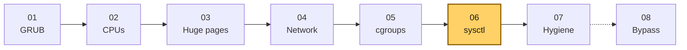
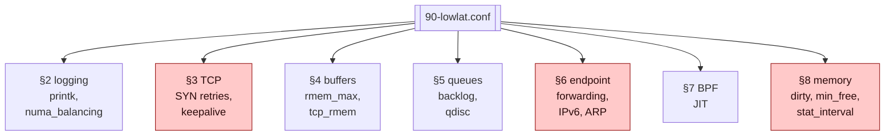
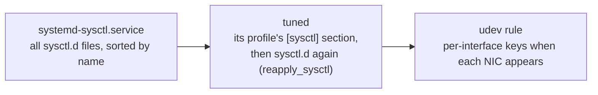
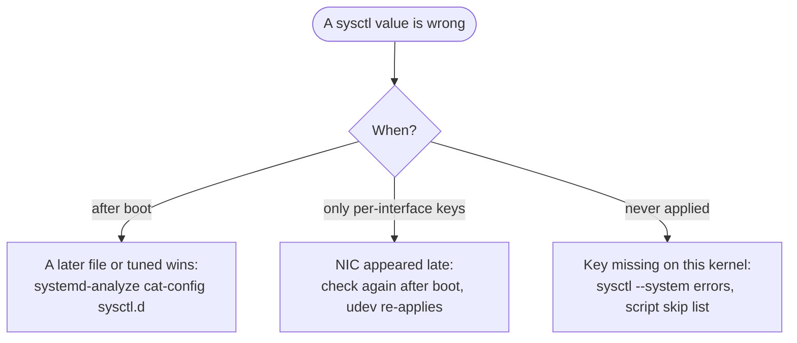

# Guide 06 — Kernel Runtime Parameters (sysctl)

> **Script:** [`scripts/06-kernel-sysctl`](../scripts/06-kernel-sysctl) · **Concepts:** [network-tuning](../concepts/network-tuning.md), [cpu-isolation](../concepts/cpu-isolation.md) · **Previous:** [Guide 05](05-cgroup-isolation.md) · **Next:** [Guide 07 — OS hygiene](07-os-hygiene.md)

| | |
|---|---|
| **Risk level** | **2 / 5**. Every value can be changed back at runtime. The riskier ones (`tcp_syn_retries`, `min_free_kbytes`, IPv6 off) are called out below. |
| **Reboot required** | No. Applied immediately, and persistent through `/etc/sysctl.d/90-lowlat.conf`. |
| **Applies to** | Bare metal and VMs. |

## At a glance

- **What:** one commented file, `/etc/sysctl.d/90-lowlat.conf`, covering kernel logging, TCP behavior, socket buffers, queues, the endpoint/ARP policy, BPF and virtual memory.
- **Why:** it removes millisecond stalls (synchronous console printing, direct reclaim, NUMA balancing faults), avoids silent packet drops (clamped buffers), and makes connections fail over fast.
- **Cost:** a few risky values that must fit the host: `tcp_syn_retries=1`, `min_free_kbytes`, and IPv6 turned off.

**Time:** ~15 min, no reboot · **Do this if:** always, on bare metal and VMs · **Skip if:** never, but scale `vm.min_free_kbytes` to the host and keep IPv6 if anything uses it.



*Guide 06 is independent of the CPU layout. It can run on any host class.*



*The profile has seven groups, one section each. The three groups marked in red hold the riskiest values: §3 (SYN retries), §6 (IPv6) and §8 (`min_free_kbytes`).*

---

## 1. Principles

- **One file, never `/etc/sysctl.conf`.** Everything goes into `/etc/sysctl.d/90-lowlat.conf`, loaded by `systemd-sysctl` at every boot. Some scripts wipe `/etc/sysctl.conf` and then apply values with `sysctl -w`: that loses whatever the host owner had there, and leaves nothing persistent unless the script re-runs at every boot.
- **Every line carries its reason.** The generated file contains a comment above each key, so the next engineer does not have to guess.
- **Skip what the kernel does not have.** `net.ipv4.tcp_shrink_window` (kernel ≥ 6.5) and `net.core.txrehash` (≥ 5.18) do not exist on stock RHEL 8/9 kernels. The script leaves them out and reports them, instead of silently ignoring the error.
- **Know who else writes sysctls.** tuned profiles ([Guide 07](07-os-hygiene.md)) set some of the same keys. On a conflict, the value that is applied last wins. Guide 07 makes the tuned profile include this file's values, so both agree.

Load order at boot:



*The last writer wins. tuned re-applies `sysctl.d` after its own values, and the per-interface keys only land once each NIC exists, because the NICs do not exist yet when `systemd-sysctl` runs.*

## 2. Kernel logging and debug

| Key | Value | Why |
|---|---|---|
| `kernel.printk` | `1 4 1 7` | Console log level 1: only `KERN_EMERG` messages are printed **synchronously** to the console. Printing to a slow console (VGA, IPMI serial) blocks the CPU that emits the message; a burst of warnings can stall a CPU for milliseconds. Everything still reaches the journal/`dmesg`. |
| `kernel.nmi_watchdog` | `0` | Same as `nmi_watchdog=0` on the command line ([Guide 01](01-grub-bootloader-tuning.md#54-silence-the-watchdogs-and-error-pollers)). Setting both makes it take effect on VMs too, where the GRUB isolation set is skipped. |
| `debug.exception-trace` | `0` | Stops the kernel from logging every user-space segfault or unhandled trap. That is a log-flood vector. |
| `kernel.ftrace_enabled` | `0` | Disables the function tracer's patching hooks. Re-enable temporarily (`sysctl -w kernel.ftrace_enabled=1`) when you need `trace-cmd`/`perf ftrace`. |
| `kernel.numa_balancing` | `0` | Automatic NUMA balancing periodically **unmaps pages to sample accesses** (hint faults) and migrates them between nodes. On a host where placement is decided on purpose (pinned threads, per-node huge pages), it only adds faults and TLB shootdowns. Also set by the tuned `network-latency` profile. |

## 3. TCP behavior

| Key | Value | What it does, and why |
|---|---|---|
| `net.ipv4.tcp_timestamps` | `1` | RFC 7323 timestamps. They improve RTT estimation, protect against wrapped sequence numbers (PAWS), and are **required** by `tcp_tw_reuse`. Some scripts claim to *disable* timestamps here while setting `1`. `1` is correct. |
| `net.ipv4.tcp_sack` | `1` | Selective ACKs let the sender retransmit only the missing segments, recovering several losses in one RTT. |
| `net.ipv4.tcp_window_scaling` | `1` | Windows above 64 KiB. Needed for the socket buffer sizes in §4. |
| `net.ipv4.tcp_slow_start_after_idle` | `0` | By default, after an idle period of one RTO, TCP resets the congestion window to its initial value. For an order connection that is quiet for a few seconds, the next burst would then be throttled. `0` keeps the window. |
| `net.ipv4.tcp_fastopen` | `3` | TCP Fast Open for client (1) and server (2). On a reconnect, data rides in the SYN, which saves one RTT. Only helps if both ends support it. |
| `net.ipv4.tcp_fin_timeout` | `5` | How long an **orphaned** socket stays in `FIN_WAIT_2` (default 60 s). It does **not** shorten `TIME_WAIT`, whatever many blog posts say. That is fixed at 60 s. |
| `net.ipv4.tcp_tw_reuse` | `1` | Lets **new outgoing** connections reuse a `TIME_WAIT` socket's port when timestamps prove it is safe. Useful for gateways that reconnect often. It does not affect incoming connections. |
| `net.ipv4.tcp_max_tw_buckets` | `262144` | Upper bound on `TIME_WAIT` sockets before the kernel destroys them early and logs a warning. |
| `net.ipv4.tcp_max_orphans` | `32768` | Sockets not attached to any process (closed but not finished) allowed before the kernel resets them. |
| `net.ipv4.tcp_syn_retries` | `1` | ⚠️ A `connect()` gives up after the initial SYN plus **one** retry (~3 s) instead of 6 retries (~127 s). For a trading gateway, fast failure means fast failover to the backup venue/session. **Risk:** on a lossy path, a single lost SYN plus a lost retry fails the connection. Applications must retry `connect()` themselves. |
| `net.ipv4.tcp_syncookies` | `1` | Keep SYN-flood protection. Cookies are only used when the SYN queue overflows. |
| `net.ipv4.tcp_abort_on_overflow` | `0` | When the accept queue is full, drop the final ACK instead of sending a RST, so the client's retransmission can succeed a moment later. |
| `net.core.somaxconn` / `net.ipv4.tcp_max_syn_backlog` | `2048` | Accept queue and half-open queue limits. `listen(fd, backlog)` is capped by `somaxconn`. |
| `net.ipv4.tcp_keepalive_time` / `_intvl` / `_probes` | `120` / `15` / `5` | Detect a dead peer after about 2 min + 5 × 15 s instead of 2 h 11 min. Applies only to sockets with `SO_KEEPALIVE`. Session protocols normally have their own heartbeats, which are faster and should be preferred. |
| `net.ipv4.tcp_moderate_rcvbuf` | `1` | Receive buffer auto-tuning between the `tcp_rmem` min and max. |
| `net.ipv4.tcp_no_metrics_save` | `0` | Keep per-destination metrics (RTT, ssthresh) in the route cache, so a reconnect to the same peer starts with good estimates. |

## 4. Socket buffers

| Key | Value | Why |
|---|---|---|
| `net.core.rmem_max`, `wmem_max` | `134217728` (128 MiB) | The largest `SO_RCVBUF`/`SO_SNDBUF` an application may request. UDP-based messaging transports size their socket buffers to their flow-control window (often 16–64 MiB). Without this ceiling, the request is **silently clamped** and packets drop under bursts. |
| `net.core.rmem_default`, `wmem_default` | `8388608` (8 MiB) | Default for sockets that never call `setsockopt`. That covers most UDP receivers in third-party libraries. |
| `net.core.optmem_max` | `134217728` | Ancillary data per socket (timestamps, `cmsg`, zerocopy notifications). |
| `net.ipv4.tcp_rmem`, `tcp_wmem` | `4096 8388608 134217728` | TCP min / default / max per socket. Auto-tuning grows up to the max. |

**Memory cost:** these are ceilings, not allocations. Memory is used only by data actually queued. Check with `ss -tmn` (`skmem`) and `cat /proc/net/sockstat`.

## 5. Queues

| Key | Value | Why |
|---|---|---|
| `net.core.netdev_max_backlog` | `300000` | Per-CPU queue between the driver (NAPI) and the protocol stack, used when packets arrive faster than the stack processes them. With coalescing 0 ([Guide 04](04-network-optimization.md#53-coalescing-0-ethtool--c-rx-usecs-0-tx-usecs-0)) and one IRQ CPU per NIC, bursts land on one CPU. Overflows show in column 2 of `/proc/net/softnet_stat`. This is an **RX** queue and has nothing to do with `txqueuelen`. |
| `net.core.default_qdisc` | `fq_codel` | Queueing discipline for new interfaces. `fq_codel` (the RHEL default) gives flow isolation and active queue management, which is good for bulk NICs. For pacing-heavy TCP senders, use `fq` explicitly with `tc` on that interface. Some scripts label this "fq" while setting `fq_codel`, and `fq_codel` is the value used here. |
| `net.core.txrehash` | `1` | Re-hash the TX queue on retransmission (kernel ≥ 5.18; skipped on RHEL 8/9). |

## 6. Endpoint, not router

| Key | Value | Why |
|---|---|---|
| `net.ipv4.ip_forward`, `net.ipv6.conf.all.forwarding` | `0` | The host is an endpoint. Forwarding enabled by accident turns it into a router between segments that are meant to be separate ([Guide 04 §3](04-network-optimization.md#3-network-segmentation-give-each-traffic-class-its-own-nic)). |
| `net.ipv6.conf.{all,default,lo,<each NIC>}.disable_ipv6` | `1` | ⚠️ IPv4-only host. It removes router advertisements, neighbor discovery, MLD reports, and their timers. **Do not apply if anything on the host uses IPv6** (including `::1` for local services). The Java property `-Djava.net.preferIPv4Stack=true` is still recommended. |
| `net.ipv4.conf.{lo,<each NIC>}.arp_ignore` | `1` | Multi-homed host: answer ARP only for addresses configured **on the interface that received the request**. Without it, the host can answer ARP for its critical IP via the management NIC, and traffic flows over the wrong network. |
| `arp_announce` / `arp_filter` / `arp_accept` | `0` | Kernel defaults, written explicitly so the file documents the complete ARP policy. For hosts with several NICs **in the same subnet**, consider `arp_announce=2` and `arp_filter=1`. |

The per-interface keys are generated from `NICS` in `lowlat.conf`, so no interface names are hard-coded in the script.

## 7. BPF

| Key | Value | Why |
|---|---|---|
| `net.core.bpf_jit_enable` | `1` | JIT-compile BPF programs (socket filters, `tc`, XDP, tracing) to native code. The interpreter is several times slower. This is the default on RHEL, and is set explicitly here. |
| `net.core.bpf_jit_limit` | `528482304` | Memory allowed for JIT images (relevant when many tracing/observability programs are loaded). |

## 8. Virtual memory

| Key | Value | Why |
|---|---|---|
| `vm.dirty_background_ratio` | `3` | Background writeback starts when 3 % of memory is dirty: small, frequent flushes. |
| `vm.dirty_ratio` | `10` | A process writing to files is **throttled synchronously** at 10 % dirty memory. Lower values mean the application's own journaling hits the limit less abruptly, because background writeback started earlier. The application's journal writer should still run on a non-critical thread. |
| `vm.min_free_kbytes` | `1048576` (1 GiB) | Raises the free-memory watermarks. `kswapd` starts reclaiming earlier, in the background, so allocations rarely fall into **direct reclaim** (reclaim done inline by the allocating thread, costing ms). ⚠️ Scale it to the host: 1 GiB is appropriate for 256 GiB+ hosts. On a 16 GiB VM, use 128–256 MiB, or you waste memory and risk OOM. |
| `vm.stat_interval` | `60` | Per-CPU VM counters are folded into global counters every `stat_interval` seconds by a per-CPU `kworker`. Going from 1 s to 60 s means 60× fewer wake-ups. With `nohz_full`, isolated CPUs are already mostly exempt, and this also quiets the housekeeping CPUs. Cost: `/proc/meminfo` counters can be up to a minute stale. |
| `fs.file-max` | `13076444` | System-wide file handle limit. Per-process limits are in [Guide 07](07-os-hygiene.md#3-resource-limits). |

Huge-page sysctls (`vm.nr_overcommit_hugepages`, `kernel.shmmni`) live in [Guide 03](03-huge-pages-configuration.md#43-sysctls). `kernel.sched_rt_runtime_us` lives in [Guide 02](02-cpu-core-isolation.md#44-real-time-throttling).

## 9. Using the script

```bash
scripts/06-kernel-sysctl --dry-run             # shows the complete file it would write
sudo scripts/06-kernel-sysctl --apply
scripts/06-kernel-sysctl --verify              # every key compared with the running value
```

Excerpt of the generated file:

```ini
# Managed by mechanical-sympathy 06-kernel-sysctl - see guides/06-kernel-sysctl-tuning.md

# Kernel logging and debug
# console loglevel 1: only emergencies are printed synchronously on the console
kernel.printk = 1 4 1 7
...
# ARP on a multi-homed host: only answer for addresses configured on the receiving interface
net.ipv4.conf.ens1f0.arp_ignore = 1
```

## 10. Verification

```bash
sysctl --system 2>&1 | grep -iE 'error|invalid|cannot'   # should print nothing relevant
sysctl net.core.rmem_max net.ipv4.tcp_rmem vm.stat_interval kernel.numa_balancing
systemd-analyze cat-config sysctl.d | grep -n 'rmem_max'  # who sets it, in which order

# Is anything else overriding us? (tuned, other sysctl.d files)
tuned-adm active; grep -r rmem_max /etc/sysctl.d /usr/lib/sysctl.d /etc/tuned 2>/dev/null
```

## 11. Troubleshooting



*A value that reverts is almost always a later writer. A per-interface key that is missing at boot is usually a NIC that appeared after `systemd-sysctl` ran.*

| Symptom | Cause | Fix |
|---|---|---|
| Value reverts after boot | A later `sysctl.d` file or the tuned profile sets it | `systemd-analyze cat-config sysctl.d`; include this file in the tuned profile ([Guide 07](07-os-hygiene.md#5-tuned-profile)) |
| `sysctl: cannot stat /proc/sys/net/ipv4/conf/ens2f0/...` at boot | Interface appears later; the udev rule re-applies it | Harmless. Verify after boot. |
| UDP receive drops (`UdpRcvbufErrors`) | Application requests more than `rmem_max`, or never sets `SO_RCVBUF` | Check the transport's buffer config; §4 |
| Connections fail to peers across a lossy WAN | `tcp_syn_retries=1` | Raise to 2–3 for those hosts |
| Local service on `::1` stopped working | IPv6 disabled | Keep IPv6 on `lo`, or bind to `127.0.0.1` |
| OOM on a small host | `vm.min_free_kbytes` too high | Scale it down (§8) |

## 12. Rollback

- [ ] Remove the file: `sudo scripts/06-kernel-sysctl --rollback`
- [ ] Reboot to get the defaults back: `sudo systemctl reboot`. Or reload the remaining files with `sudo sysctl --system`, which does not reset keys that no file sets.
- [ ] Confirm: `sysctl vm.stat_interval` shows `1`

## 13. Key takeaways

- One file in `/etc/sysctl.d/`, a reason above every key, and nothing in `/etc/sysctl.conf`.
- The last writer wins: `systemd-sysctl`, then tuned (which re-applies `sysctl.d`), then udev for per-interface keys.
- Buffer maxima are ceilings, not allocations. Too low a ceiling silently clamps a transport's buffer and drops packets.
- `tcp_syn_retries=1`, IPv6 off and `min_free_kbytes` are host-specific. Check each one before applying.
- `vm.stat_interval=60` and `kernel.numa_balancing=0` remove periodic wake-ups and hint faults.

## 14. References

- <https://docs.kernel.org/admin-guide/sysctl/net.html>, <https://docs.kernel.org/networking/ip-sysctl.html>, <https://docs.kernel.org/admin-guide/sysctl/vm.html>
- `man 5 sysctl.d`, `man 8 systemd-sysctl`
