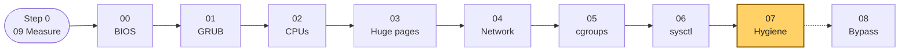
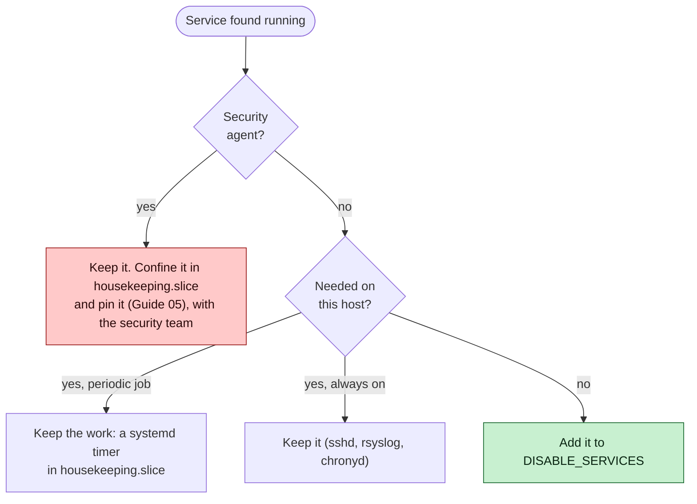
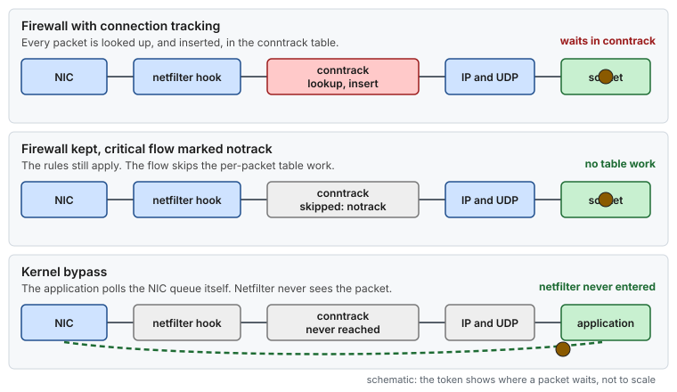
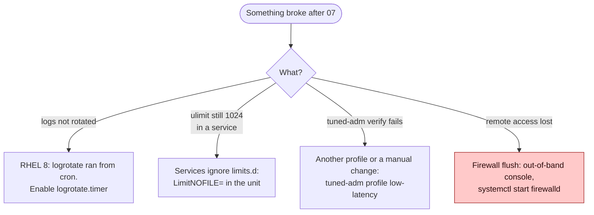

# Guide 07 — Operating System Hygiene

> **Script:** [`scripts/07-os-hygiene`](../scripts/07-os-hygiene) · **Previous:** [Guide 06](06-kernel-sysctl-tuning.md) · **Next:** [Guide 08 — Kernel bypass](08-kernel-bypass.md) (optional), or [Guide 10 — Time synchronization](10-time-sync.md) · **Terms:** [Glossary](../GLOSSARY.md)

| | |
|---|---|
| **Risk level** | **2 / 5** for services, limits, noatime and tuned. **5 / 5** for the opt-in firewall and netfilter section (§6): that removes a security control. |
| **Reboot required** | No |
| **Applies to** | Bare metal and VMs |

## At a glance

- **What:** stop periodic and idle-time services, set per-application resource limits, mount local filesystems `noatime`, and install a `tuned` profile that fixes frequency and C-states.
- **Why:** none of these is large on its own, but together they are the background noise behind unexplained p99.9 spikes on the housekeeping CPUs, where your NIC interrupts are served.
- **Cost:** fewer conveniences (cron, `sar` history). The opt-in firewall section removes a security control.

**Time:** ~30 min, no reboot · **Do this if:** always, on bare metal and VMs · **Skip if:** never. Skip §6 unless security has signed off in writing.



*Guide 07 closes the host-wide sequence. Guide 08 applies only with a kernel-bypass stack, and Guides 09 to 12 apply to every host ([QUICK_START](../QUICK_START.md#reading-order-and-run-order) gives the run order).*

---

## 1. Why

After Guides 01–06, the isolated CPUs are quiet. This guide reduces what happens **everywhere else**: periodic jobs, idle-time daemons, metadata writes, power management, and packet-filter hooks on the network path. None of these are large on their own. Together they are the background noise that shows up as unexplained p99.9 spikes on the housekeeping CPUs, where your NIC interrupts are served.

> **Picture it.** The isolated CPUs are a quiet room. The housekeeping CPUs are the corridor outside, where the mail (the NIC interrupts) arrives. This guide stops people from holding meetings in the corridor.

## 2. Services

`disable_unnecessary_services` stops and disables everything in `DISABLE_SERVICES` (in `lowlat.conf`). Before adding a service to that list, ask:



*Security agents are confined, never silently disabled. Periodic jobs move to timers in the housekeeping slice. Only what the host really doesn't need is disabled.*

The reference list, and why each entry is there:

| Service(s) | What it does | Why disable it |
|---|---|---|
| `crond` | Periodic jobs | Unplanned work at arbitrary times (package-cache refreshes, report scripts, `sa1`). Move the jobs you need to systemd timers in `housekeeping.slice` ([Guide 05](05-cgroup-isolation.md)). **On RHEL 8, logrotate runs from cron** (`/etc/cron.daily/logrotate`). Enable `logrotate.timer`, or keep a timer for it. On RHEL 9 logrotate is already a systemd timer. |
| `plymouth-*` | Boot splash screen | No console to show it on. Pure boot-time and shutdown overhead. |
| `rpcbind`, `rpc-statd-notify`, `auth-rpcgss-module`, `rpc_pipefs`, `nfs-client.target`, `remote-fs-pre.target` | NFS client plumbing | Not needed unless the host mounts NFS. Also a network-facing service with its own timers. |
| `sysstat-collect.timer`, `sysstat-summary.timer` | `sar` data collection every 10 min | Periodic `/proc` walks. Keep them if `sar` is your capacity-planning tool, and move them into `housekeeping.slice`. |
| `pcscd` | Smart-card daemon | No smart cards on servers |
| `cpupower`, `cpuspeed`, `cpufreqd`, `powerd` | Frequency/power daemons | They fight the fixed `performance` governor that tuned sets (§5) |
| **EDR / antivirus / cloud agents** | Security and management agents | **Do not disable them without your security team.** Either the site policy allows turning them off on latency-critical hosts (and then do it, add them to the list), or confine them: [Guide 05](05-cgroup-isolation.md) slice plus pinning. A launcher that **refuses to start** while such an agent is running, unless the environment explicitly allows it, is a useful guard rail in production. |

`firewalld` has its own switch (`DISABLE_FIREWALLD`, default `no`). See §6.

`rsyslog` is kept **on** (`ensure_rsyslog`). Local logging is cheap, runs on OS CPUs, and without it you lose the kernel messages you need during an incident.

## 3. Resource limits

`/etc/security/limits.d/90-lowlat.conf` (for login sessions, via PAM):

```text
@app-user  soft  nproc    65535
@app-user  hard  nproc    65535
@app-user  soft  nofile   65535
@app-user  hard  nofile   65535
@app-user  -     rtprio   99
@app-user  -     nice     -20
@app-user  -     memlock  unlimited
```

| Limit | Why |
|---|---|
| `nofile` | Sockets + journal/log files + memory-mapped files per process. The default 1024 is too low for a gateway. |
| `nproc` | Threads count against `nproc`. JVMs with many pools can hit the default. |
| `rtprio` | Lets the application set `SCHED_FIFO` on its own threads without root ([Guide 02 §6.5](02-cpu-core-isolation.md#65-real-time-scheduling-class-usually-unnecessary)) |
| `nice` | Lets it raise the priority of its non-critical threads |
| `memlock` | `mlockall()` the process so that page-cache pressure can never evict its code or non-huge-page data |

Scope matters. Some scripts truncate `/etc/security/limits.conf` and write `* - rtprio 99` for **every** user. Here the limits apply only to the application's group, in a separate file, and `limits.conf` is left alone.

These limits apply to **PAM sessions** (SSH logins, `su -`). Services started by systemd do **not** read `limits.d`. Use `LimitNOFILE=`, `LimitRTPRIO=`, `LimitMEMLOCK=` in the unit ([Guide 05 §4.4](05-cgroup-isolation.md#44-the-cpuset-trap)), or `DefaultLimit*=` in `system.conf` ([Guide 02 §4.1](02-cpu-core-isolation.md#41-systemd-cpuaffinity-persistent)). [Guide 12](12-memory-pressure.md#45-the-memlock-limit-why-limitsd-is-not-enough) sets `LimitMEMLOCK=infinity` for the services in `LATENCY_UNITS`.

## 4. `noatime`

By default (`relatime`), reading a file can still update its access time on disk, which means a metadata write, a journal transaction, and eventually I/O. `set_noatime_mounts` adds `noatime` to local `xfs`/`ext4` entries in `/etc/fstab` and remounts them. (`noatime` implies `nodiratime`.) Swap, tmpfs, NFS and other types are left alone.

Side effect: tools that rely on atime, such as some mail readers and `tmpwatch` in atime mode, see stale values. That is irrelevant on a dedicated latency-critical host.

## 5. tuned profile

`tuned` applies a coherent set of power and latency settings, and re-applies them at every boot. The script installs a custom profile in `/etc/tuned/low-latency/tuned.conf`
on RHEL 8/9, or `/etc/tuned/profiles/low-latency/tuned.conf` on RHEL 10.
`TUNED_PROFILE_DIR` overrides that directory. The profile contents are the same:

```ini
[main]
summary=Low latency: network-latency + mechanical-sympathy host settings
include=network-latency

[cpu]
governor=performance
energy_perf_bias=performance
min_perf_pct=100
```

`min_perf_pct` only acts through `intel_pstate`. [Guide 01](01-grub-bootloader-tuning.md#53-frequency-and-power) turns that driver off, so on a host with the full command line the `performance` governor of `acpi-cpufreq` holds the clock, and the line is harmless.

What `network-latency` brings (through `latency-performance`):

| Setting | Effect |
|---|---|
| `force_latency` (PM QoS) | Holds `/dev/cpu_dma_latency` open with a very low value (a power-management quality-of-service request, PM QoS), so cpuidle cannot pick deep C-states. This is redundant with `idle=poll` on bare metal, and it is the main C-state control in VMs. |
| `governor=performance` | Fixed maximum frequency (with `acpi-cpufreq` after `intel_pstate=disable`, [Guide 01](01-grub-bootloader-tuning.md#53-frequency-and-power)) |
| `transparent_hugepages=never` | Same as the boot argument |
| `kernel.numa_balancing=0` | Same as [Guide 06](06-kernel-sysctl-tuning.md#2-kernel-logging-and-debug) |
| `net.core.busy_read=50`, `net.core.busy_poll=50` | **Busy polling** for all sockets: a blocking `recv`/`poll` spins on the NIC queue for up to 50 µs before sleeping ([Guide 04 §6.1](04-network-optimization.md#61-choosing-the-cpu), model B). A thread that already spins on a non-blocking socket (model A) is not affected. |
| `net.ipv4.tcp_fastopen=3` | Same as Guide 06 |

**Ordering with Guide 06.** tuned applies its `[sysctl]` values and then, because `reapply_sysctl = 1` is the default in `/etc/tuned/tuned-main.conf`, re-applies `/etc/sysctl.d/`. So on any conflict the Guide 06 file wins, and the script makes sure the option has not been turned off. Some scripts run `tuned-adm profile network-latency` *before* writing their sysctls with `sysctl -w`. That works until the next reboot, when tuned and the missing persistence change the result.

**Why not cpu-partitioning?** Red Hat's `cpu-partitioning` profile also writes the isolation boot arguments and the CPU masks, which Guides 01 and 02 already own. This profile adds only what the scripts leave to tuned. [Concept: RHEL's own tuning tools](../concepts/rhel-tuning-tools.md) compares them setting by setting, and says when the profile is the better choice.

```bash
tuned-adm active                  # Current active profile: low-latency
tuned-adm verify                  # checks that the profile's settings are in effect
```

## 6. Opt-in: removing host packet filtering

> [!CAUTION]
> **This section removes a security control. It is disabled by default.**

Every packet traverses the netfilter hooks. With connection tracking loaded, each packet also does a conntrack table lookup/insert (hashing, locking, per-flow state, timers), even if the rule set is empty. On a gateway handling millions of small messages, removing that per-packet work, and the conntrack table's garbage-collection work, is measurable, typically a few hundred ns to a few µs per packet in the tail.

Removing the filtering takes three steps, and each one has its own switch:

| Switch | What it does |
|---|---|
| `DISABLE_FIREWALLD=yes` | Stops and disables firewalld |
| `FLUSH_FIREWALL_RULES=yes` | Flushes nftables and iptables/ip6tables in all tables, deletes user chains, and sets policies to ACCEPT |
| `REMOVE_NETFILTER_MODULES=yes` | Unloads NAT, conntrack helpers, `xt_*` matches, `ip_tables`/`ip6_tables` (21 modules, in dependency order) |

**Sign-off checklist. Every box must be ticked before any switch is set to `yes`:**

- [ ] The host sits behind a **network firewall/ACL** that enforces the same policy (only the upstream clients and peers, the internal services, and the management network can reach it).
- [ ] The management network is separate ([Guide 04 §3](04-network-optimization.md#3-network-segmentation-give-each-traffic-class-its-own-nic)) and access-controlled.
- [ ] Your security team has approved it in writing, as an exception for this host class.
- [ ] No local service depends on NAT, masquerading, or port forwarding (containers, libvirt).
- [ ] The out-of-band console works, in case remote access is lost.



*Connection tracking adds per-packet table work even with an empty rule set. `notrack` keeps the rules and skips the table; kernel bypass skips netfilter altogether.*

Alternatives with most of the benefit and less risk:

- Keep the firewall, but exempt the critical flows from conntrack with `notrack` rules in the `raw` table. The rules still apply, but there is no per-flow state.
- Use kernel bypass for the critical NICs ([Guide 04 §7](04-network-optimization.md#7-kernel-bypass-optional)). Those packets never reach netfilter.

Module unloading and rule flushing are **not persistent**. When opted in, `lowlat-runtime.service` repeats them at every boot (`07-os-hygiene --runtime`). To make module removal stick, blacklist them in `/etc/modprobe.d/` (`install <module> /bin/false`) as well.

## 7. Things this guide deliberately does *not* do

| Seen elsewhere | Why not here |
|---|---|
| `rm /dev/random && ln -s /dev/urandom /dev/random` | Since kernel 5.6, and in the RHEL 8 backport, `/dev/random` only blocks until the kernel's random number generator (CRNG) is initialized at early boot, so it no longer blocks in normal operation. The symlink is also lost at every boot (devtmpfs). For Java, use `-Djava.security.egd=file:/dev/urandom` (the `file:/dev/./urandom` spelling is a workaround for very old JDKs). |
| Killing all application processes before tuning | Tuning must be applied **before** the application starts, at boot, by `lowlat-runtime.service`. A tuning script that kills production processes is a hazard. Apply changes in a maintenance window instead. |
| Re-running the whole tuning script from `rc.local` | No ordering, no status, and it re-does persistent steps (GRUB, file edits) on every boot. Only runtime state is re-applied at boot, by a systemd unit ([`scripts/systemd/lowlat-runtime.service`](../scripts/systemd/lowlat-runtime.service)). |

## 8. Using the script

```bash
scripts/07-os-hygiene --dry-run
sudo scripts/07-os-hygiene --apply
scripts/07-os-hygiene --verify
```

## 9. Verification

```bash
systemctl list-units --type=service --state=running --no-pager      # what is left running
systemctl list-timers --all --no-pager                              # periodic work
ulimit -a        # as app-user in a new SSH session: nofile, nproc, rtprio, memlock
findmnt -t xfs,ext4 -o TARGET,OPTIONS                               # noatime
tuned-adm active && tuned-adm verify
cat /sys/devices/system/cpu/cpu0/cpufreq/scaling_governor          # performance
nft list ruleset | head; iptables -S | head; lsmod | grep -E 'nf_conntrack|ip_tables'
```

## 10. Troubleshooting



*The common breakages map one-to-one to a section: cron and logrotate (§2), limits (§3), tuned (§5) and the opt-in firewall (§6).*

| Symptom | Cause | Fix |
|---|---|---|
| Logs no longer rotated (RHEL 8) | `crond` disabled | `systemctl enable --now logrotate.timer` (or keep a cron replacement timer) |
| `ulimit -n` still 1024 in a service | Services do not read `limits.d` | `LimitNOFILE=` in the unit |
| `tuned-adm verify` fails | Another profile or a manual change overrides a setting | `tuned-adm profile low-latency`; check `/var/log/tuned/tuned.log` |
| `modprobe -r` "Module is in use" | Rules or another module still reference it | Flush rules first; containers/libvirt may hold them |
| Remote access lost after flushing rules | Policy was ACCEPT but a network ACL relied on host state | Use the out-of-band console; restore with `systemctl start firewalld` |

## 11. Rollback

- [ ] Stop the boot-time re-apply, then restore the first-apply baseline (for a whole host, use `sudo scripts/apply-all --rollback`):

  ```bash
  sudo systemctl disable --now lowlat-runtime.service
  sudo scripts/07-os-hygiene --rollback
  ```

- [ ] Mounts: `findmnt -rn -t xfs,ext4 -o TARGET,OPTIONS`, and `/etc/fstab` against the saved original.
- [ ] Limits: the limits file against the saved original. New sessions get the old limits; running applications keep theirs until restarted.
- [ ] tuned and services: `tuned-adm active`, and `systemctl is-enabled` and `systemctl is-active` for each affected service.
- [ ] If §6 ran: `nft list ruleset`, `iptables-save`, `ip6tables-save` and `/proc/modules` against the saved files. A firewall manager may change rules when it restarts, so check the resulting policy too.

What the rollback restores, and when it refuses:

- **Files and state.** Limits, fstab, the tuned configuration and profile selection, and each affected service's enabled and running state, rsyslog and firewalld included. Files that did not exist before are removed. Mount options are restored at once with a remount.
- **Its baseline.** Originals live under `/var/lib/lowlat/factory-settings` and survive repeated applies and the boot-time re-apply. Use the same configuration and path overrides as for the apply. Without an earlier apply, rollback does nothing.
- **Firewall and modules (§6).** Before removing anything, the apply saves the complete nftables and IPv4/IPv6 iptables rules and the loaded modules, and stops if it cannot (it needs `nft`, `iptables-save`, `ip6tables-save`, `iptables-restore` and `ip6tables-restore`). The rollback reloads the modules first, then the rules, then the services.
- **It stops loudly** on missing or damaged saved state, a failed remount or a refused restore command. Keep the baseline, fix the cause and run it again. If a mount cannot be remounted safely, reboot and check its options against the restored fstab.
- **What it cannot bring back:** lost connections, expired conntrack entries, and work that stopped with the services.

`--verify` checks the tuned state, so it may report FAIL lines after a rollback. To tune again, run `sudo scripts/07-os-hygiene --apply`.

> [!NOTE]
> **Validate on your hardware.** The automated checks cover this rollback, but filesystems, tuned plugins and firewall backends differ. Check the result on your host.

## 12. Bare metal vs VM

| | Bare metal | VM |
|---|---|---|
| Services, limits, `noatime` | ✅ | ✅ |
| tuned profile | ✅ `idle=poll` already holds the C-states | ✅ Its PM QoS request is the main C-state control in a VM |
| `performance` governor | ✅ | Usually no frequency control in the guest; tuned skips what is missing |
| §6 firewall removal | Opt-in, with sign-off | Opt-in, with sign-off; the hypervisor's own filtering still applies |

## 13. Key takeaways

- Disable what the host does not need, move periodic work to timers in `housekeeping.slice`, and never silently disable security agents.
- Limits go to the application's group only, in `limits.d`. Services take `Limit*=` in their unit.
- tuned holds frequency and C-states steady at every boot, and `sysctl.d` still wins on conflicts.
- Removing host packet filtering is opt-in, needs written sign-off, and has lower-risk alternatives (`notrack`, bypass).

## 14. References

- `man 7 tuned-profiles`, `man 5 tuned-main.conf`, `man 5 limits.conf`, `man 8 mount` (`noatime`)
- Red Hat — *Monitoring and managing system status and performance*: "Getting started with TuneD"
- `man 8 nft` (`notrack`), <https://docs.kernel.org/networking/nf_conntrack-sysctl.html>
