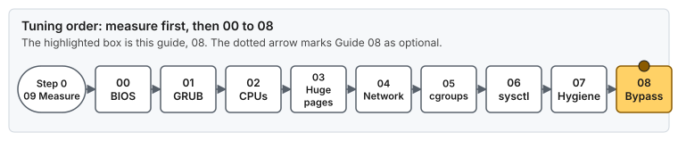
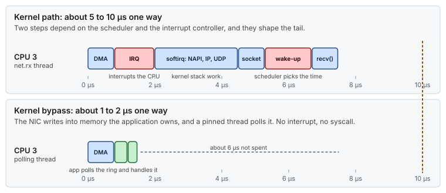
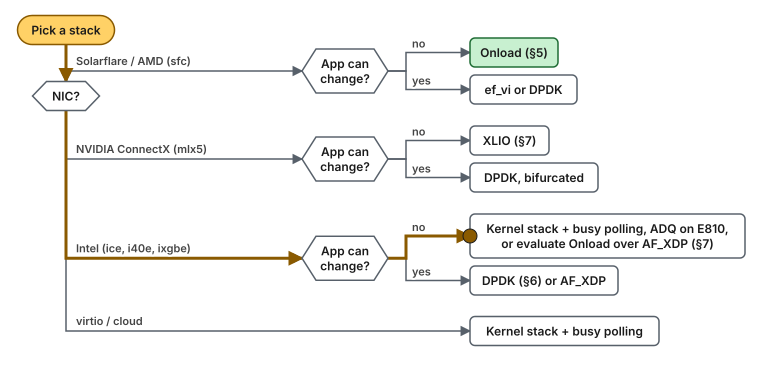
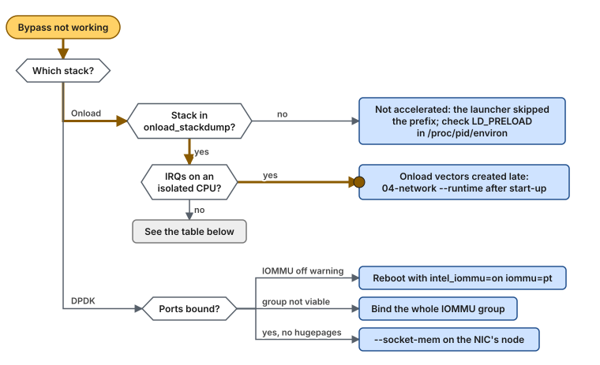

# Guide 08 — Kernel Bypass (Onload, DPDK, and the Alternatives)

> **Script:** [`scripts/08-kernel-bypass`](../scripts/08-kernel-bypass) · **Concepts:** [network-tuning §8–9](../concepts/network-tuning.md#9-kernel-bypass), [ethtool reference](../concepts/ethtool.md) · **Previous:** [Guide 07](07-os-hygiene.md) · **Next:** [Guide 10 — Time synchronization](10-time-sync.md) · **Builds on:** [Guide 04 — Network](04-network-optimization.md) · **Terms:** [Glossary](../GLOSSARY.md)

| | |
|---|---|
| **Risk level** | **4 / 5**. Reloading bypass drivers takes the NIC's links down for a few seconds. Binding a port to DPDK removes it from the kernel entirely, and on the wrong PCI address that is the port you are logged in through. |
| **Reboot required** | Onload: no (driver reload). DPDK with `vfio-pci`: **yes, once**, to turn the IOMMU on ([Guide 01](01-grub-bootloader-tuning.md#56-iommu-and-cpu-vulnerability-mitigations-security-sensitive)). |
| **Applies to** | Bare metal. VMs only with an SR-IOV virtual function or a passed-through NIC (§12). |
| **Depends on** | [Guide 02](02-cpu-core-isolation.md) (isolated CPUs for the polling threads), [Guide 03](03-huge-pages-configuration.md) (huge pages for packet buffers), [Guide 04](04-network-optimization.md) (the kernel side of the NICs) |
| **Optional** | Yes. Everything in Guides 01–07 works without it. `apply-all` runs this guide only when `KERNEL_BYPASS_STACK` is set. |

## At a glance

- **What:** let the application poll the NIC's queues from user space, either unmodified through socket acceleration (Onload, XLIO) or rewritten against a poll-mode API (DPDK).
- **Why:** one-way latency drops from about 5–10 µs on a tuned kernel stack to about 1–2 µs, with a much tighter tail.
- **Cost:** a spinning isolated core per polling thread, a vendor stack to operate, huge pages, and traffic that `tcpdump`, `ss` and the firewall no longer see.

**Time:** half a day to a few days, depending on the stack · **Do this if:** the tuned kernel stack is measured and still too slow, and your NIC has a supported stack · **Skip if:** you have not measured Guides 01–07 yet, or the NIC is Intel and the application is an unmodified JVM (try busy polling first).



*Guide 08 is optional and builds on Guides 02, 03 and 04.*

---

## 1. What kernel bypass is, and what it costs

On the kernel path, a received packet raises an interrupt and is processed in a softirq by the IP/UDP/TCP stack, copied into a socket buffer, and handed to the application through a syscall that may also wake a sleeping thread. [Guide 04](04-network-optimization.md) makes each of those steps as fast and as predictable as the kernel allows. A tuned kernel path still costs roughly **5–10 µs one way**, and its tail is shaped by softirq scheduling.

A **kernel-bypass stack** maps a NIC's hardware queues (descriptor rings and doorbell registers) into the application's address space. The NIC writes packets (by DMA) straight into memory the application owns, and an application thread **polls** the ring:



*The same packet on both paths, on one time scale: bypass removes the interrupt, the softirq, the socket and the wake-up, which are the steps that shape the kernel path's tail.*

> **Picture it.** The kernel path is a hotel front desk: the parcel arrives, someone rings your room, a porter carries it up, and you open the door. Bypass puts the mailbox in your room, and you check it every moment.


*The same packet counted in queues and copies. Bypass also moves the drop counters to the stack's own tools ([Concept: network buffers §7](../concepts/network-buffers.md#7-buffers-under-kernel-bypass)).*

That brings one-way latency down to roughly **1–2 µs**, with a much tighter tail. It costs:

- **One spinning core per polling thread**, on an isolated CPU ([Guide 02](02-cpu-core-isolation.md)).
- **Vendor-specific software and tuning**: its own configuration, its own statistics, its own upgrade cycle.
- **Huge pages** for packet buffers ([Guide 03](03-huge-pages-configuration.md)).
- **Different operations**: `tcpdump`, `ss`, `netstat`, iptables and conntrack do not see accelerated traffic.

> [!NOTE]
> **Sources.** Onload (§5) follows the [Onload repository](https://github.com/Xilinx-CNS/onload) and the *Onload User Guide*. DPDK (§6) and the stacks in §7 follow their upstream documentation, listed in §14. Behavior depends on the NIC, firmware, driver and kernel versions, so validate each stack on your hardware before relying on it.

## 2. The families, and which one fits your card and application

| Family | Examples | Application change | The kernel netdev | Notes |
|---|---|---|---|---|
| **Socket acceleration** | OpenOnload (Solarflare/AMD `sfc`), XLIO/VMA (NVIDIA `mlx5`) | **None**: an `LD_PRELOAD` library intercepts the socket calls | stays | a user-space TCP/UDP stack behind the POSIX socket API; runs unmodified JVMs |
| **Raw frame / poll-mode API** | DPDK (any supported NIC), ef_vi (Solarflare/AMD) | **Rewrite**: the application sends and receives Ethernet frames | removed (DPDK on Intel), or stays (mlx5, ef_vi) | no TCP unless you bring a user-space TCP stack |
| **Kernel-assisted fast paths** | busy polling, AF_XDP, Intel ADQ | none (busy polling, ADQ) or a rewrite (AF_XDP) | stays | not full bypass, but they remove the interrupt and wake-up from the critical path |

Which one fits depends on the NIC and on whether the application can change:



*An unmodified application on an Intel NIC has no vendor socket-acceleration stack, so start with busy polling.*

| NIC | Unmodified socket application (for example a JVM) | Custom packet-processing code |
|---|---|---|
| **Solarflare / AMD** (X2, X3, `sfc`) | **Onload** (§5) | ef_vi, or DPDK |
| **NVIDIA ConnectX** (`mlx5`) | **XLIO** (successor of VMA) (§7) | DPDK (bifurcated: the netdev stays) |
| **Intel** (E810 `ice`, X710 `i40e`, 82599/X5xx `ixgbe`) | No vendor socket-acceleration stack. Use a **tuned kernel stack + busy polling**, **ADQ** on E810, or evaluate **Onload over AF_XDP** (§7). | **DPDK** (§6), or AF_XDP |
| virtio / cloud NICs | Tuned kernel stack + busy polling | DPDK (virtio or vendor PMD), AF_XDP |

Intel NICs have no Intel-supported equivalent of Onload. **Running an unmodified JVM over DPDK is not a realistic option**: DPDK gives you Ethernet frames, not sockets. The usual design is a small C/C++ process that owns the DPDK port and exchanges messages with the JVM through shared memory. That is a new component with its own failure modes, not a tuning step.

## 3. What happens to the kernel queues: the `combined` question

[Guide 04 §5.1](04-network-optimization.md#51-queues-channels-ethtool--l) sets the number of kernel queues (`ethtool -L … combined N`). What that number should be depends on who owns the data path:

| Stack | Does the kernel still see the port? | Who handles the latency-critical packets | Kernel queues (`combined`) | IRQ placement |
|---|---|---|---|---|
| **None** (tuned kernel stack) | yes | kernel queues | **one per IRQ CPU** (Guide 04 §5.1) | all of them, on housekeeping CPUs |
| **Onload** on `sfc` | yes | **Onload's own hardware queues** (virtual interfaces, one set per Onload stack), outside the kernel's channel count | **1**: only ARP, ICMP and unaccelerated sockets remain | the one kernel queue, plus any vectors Onload creates (§5.4) |
| **XLIO** on `mlx5` | yes | XLIO's own queues | small (1–2) | same as Onload |
| **DPDK** on Intel (`vfio-pci`) | **no**: the port is unbound from `ice`/`i40e` and disappears from `ip link` | the DPDK application's poll-mode driver | **not applicable**: `ethtool` cannot reach the port | none: poll mode has no interrupts |
| **DPDK** on `mlx5` (bifurcated) | yes | DPDK queues, selected by flow rules | size for the traffic you leave to the kernel | kernel queues only |
| **AF_XDP** | yes | one or more **kernel** queues, handed to the AF_XDP socket | ≥ 2: the dedicated queue(s) plus the rest | the dedicated queue's IRQ on its polling CPU, or busy poll |

So, on the original question:

- **`combined 1` on a Solarflare NIC running Onload is right**, because Onload does not use the kernel's channels for accelerated traffic. More kernel queues would only add interrupt vectors to place and memory to pin.
- **It does not carry over to DPDK on Intel.** There, the port leaves the kernel, and running `ethtool -L` before binding has no lasting effect.
- **Without bypass, `combined 1` is still the right answer when all of that NIC's interrupts go to one CPU.** That is why [Guide 04](04-network-optimization.md#51-queues-channels-ethtool--l) now derives the queue count from the IRQ CPUs, for every NIC.

The equivalent at driver load time for `sfc` is the module option `rss_cpus=1`, which the script writes to `/etc/modprobe.d/lowlat-sfc.conf` (§5.2). With it, the queue count is right from the moment the driver loads, before `lowlat-runtime.service` runs.

## 4. Prerequisites

| Requirement | Why | Where |
|---|---|---|
| **Isolated CPUs** on the NIC's NUMA node | each polling thread spins on its own CPU | [Guide 02](02-cpu-core-isolation.md), `cat /sys/class/net/<if>/device/numa_node` |
| **Huge pages on that node** | packet buffers and DMA-mapped memory; fewer TLB misses and IOMMU mappings | [Guide 03](03-huge-pages-configuration.md): size the per-node pool for the bypass buffers as well (heap + code cache + bypass buffers + 10–20 %) |
| **The stack must fail without huge pages** | a silent fallback to 4 KiB pages shows up as unexplained jitter | Onload: `EF_USE_HUGE_PAGES=2`; DPDK fails to start without them |
| **IOMMU on**, for `vfio-pci` (DPDK) | VFIO hands a device to user space safely by confining its DMA through the IOMMU | [Guide 01](01-grub-bootloader-tuning.md#56-iommu-and-cpu-vulnerability-mitigations-security-sensitive): with `KERNEL_BYPASS_STACK=dpdk`, the script sets `intel_iommu=on iommu=pt` (reboot) |
| **Firmware and driver versions** matching the stack's release notes | bypass stacks program the NIC directly | vendor release notes |
| **The switch port** configured like the NIC (no PAUSE, same FEC) | unchanged from the kernel path | [Guide 04 §5.4](04-network-optimization.md#54-pause-frames-off-ethtool--a-autoneg-off-rx-off-tx-off), [ethtool §14](../concepts/ethtool.md#14-physical-layer--s-fec-eee--m) |

On `iommu=pt`: in passthrough mode, devices that stay with kernel drivers use identity DMA mappings and pay almost nothing for the IOMMU. Only the devices bound to `vfio-pci` get real translation. VFIO also has an "unsafe no-IOMMU" mode (`vfio.enable_unsafe_noiommu_mode=1`). It removes the protection that makes VFIO safe, so do not use it outside a lab.

## 5. Onload on Solarflare / AMD NICs

### 5.1 How Onload works

Onload is a user-space TCP/UDP stack. The `onload` launcher sets `LD_PRELOAD`, so the application's `socket()`, `send()`, `recv()`, `epoll_wait()` and related calls go to Onload instead of the kernel. For each accelerated socket, Onload:

- creates a **stack** (a set of hardware queues on the NIC, plus packet buffers in huge pages);
- installs **hardware filters** that steer the socket's traffic into those queues (you can see them with `onload_stackdump filters`, and on some NICs with `ethtool -n`);
- **spins** inside blocking calls for up to `EF_POLL_USEC` µs, polling its queues directly, before falling back to an interrupt-driven sleep.


*A hardware filter picks the VI (virtual interface: one RX queue, one TX queue and one event queue), the NIC writes into packet buffers that your process owns, and a spinning thread reads the event queue. The defaults for each limit are in [Concept: network buffers §7.2](../concepts/network-buffers.md#72-solarflare-ef_vi-and-onload).*

Traffic Onload does not accelerate still goes through the kernel `sfc` driver and its channels: ARP, ICMP, loopback by default, and sockets the application creates before Onload is loaded. Hence the single kernel queue of §3.

### 5.2 Driver options, and the reload

`lowlat.conf`:

```bash
KERNEL_BYPASS_STACK=onload
KERNEL_BYPASS_DRIVER=sfc              # 04-network: these NICs get one combined queue
KERNEL_BYPASS_COMMAND=onload          # ...but only when Onload is actually installed
ONLOAD_SFC_MODULE_OPTIONS="rss_cpus=1"
BYPASS_HOUSEKEEPING_CPU=1             # node-local housekeeping CPU (never an isolated one)
```

`08-kernel-bypass --apply` does three things:

- It writes `options sfc rss_cpus=1` to `/etc/modprobe.d/lowlat-sfc.conf`. The kernel's own RSS then uses one queue from driver load.
- It reloads the drivers **pinned to the housekeeping CPU**: `taskset -c 1 onload_tool reload`. The kernel threads and driver allocations created during the load inherit that CPU, instead of landing on an isolated CPU.
- It leaves the kernel queue count and IRQ placement to `04-network`, which `apply-all` runs **after** this script, because the reload resets everything `04-network` had set on the `sfc` NICs.

Other `sfc` and Onload module options exist (for example NUMA-local RSS, interrupt moderation defaults, PIO buffers). Their names differ between the in-tree driver and the one shipped with Onload, so check `modinfo sfc` and your Onload release notes before adding any to `ONLOAD_SFC_MODULE_OPTIONS`.

### 5.3 The application profile

Onload is configured through `EF_*` environment variables, usually grouped in a **profile** file passed with `onload -p <profile>`. The profiles shipped with Onload (`latency`, `latency-best`, `throughput`, …) are a starting point; list them with `rpm -ql onload | grep '\.opf$'`. The settings that matter here:

| Variable | Setting | Why |
|---|---|---|
| `EF_POLL_USEC` | large (for example `100000`), or what the `latency` profile sets | spin in blocking calls instead of sleeping. The CPU is isolated and dedicated anyway. |
| `EF_USE_HUGE_PAGES=2` | **required** | fail at start-up if huge pages are missing, instead of silently using 4 KiB pages |
| `EF_PREFAULT_PACKETS` | the expected number of packet buffers | allocate and touch buffers at start-up, not on the first burst |
| `EF_NAME` | a stack name per process | readable `onload_stackdump` output; processes with the same name share a stack |

The launcher adds the prefix only when the runtime is installed, so that the same launcher works on hosts without Onload:

```bash
PREFIX=()
if command -v onload >/dev/null 2>&1 && [[ "${KERNEL_BYPASS:-yes}" == yes ]]; then
	PREFIX=(onload -p latency)
fi
exec "${PREFIX[@]}" java "${JVM_OPTIONS[@]}" -cp "${CLASSPATH}" "${MAIN_CLASS}"
```

Pin the Java threads that call `recv`/`epoll_wait` to isolated CPUs on the NIC's node, as for any spinning thread ([Guide 02 §6](02-cpu-core-isolation.md#6-pinning-the-application)).

### 5.4 Interrupts that Onload creates

When a thread's spin budget runs out, Onload arms interrupts on its own queues so that the thread can sleep. Those vectors belong to the NIC's PCI function. `04-network` places **every** MSI-X vector of the function (`/sys/class/net/<if>/device/msi_irqs`), so re-run `04-network --runtime` after the application has started, or order the application unit before `lowlat-runtime.service` on hosts where it starts at boot. Then check that no vector of the NIC counts interrupts on an isolated CPU (`verify-tuning` does this).

### 5.5 Verifying Onload

```bash
onload --version
onload_stackdump                     # one line per stack: is the process accelerated at all?
onload_stackdump lots | less         # per-stack detail: sockets, counters, huge page use
onload_stackdump filters             # the hardware filters steering each socket
onload_tcpdump -i ens1f0             # packet capture of accelerated traffic (tcpdump cannot see it)
```

An application that starts but shows **no stack** in `onload_stackdump` is running on the kernel path: see §10.

## 6. DPDK on Intel NICs

> [!NOTE]
> **Source.** This section follows the [DPDK documentation](https://doc.dpdk.org/guides/linux_gsg/), the [DPDK repository](https://github.com/DPDK/dpdk) and the Intel NIC guides. Validate it on your hardware before relying on it.

### 6.1 How it works

DPDK replaces the kernel driver with a **poll-mode driver** (PMD) inside the application. Setup takes four steps:

1. Turn the IOMMU on (§4).
2. Unbind the port from `ice`/`i40e`/`ixgbe` and bind it to `vfio-pci`.
3. Give the application huge pages.
4. Pin its lcores (DPDK's polling threads) to isolated CPUs.

From then on the port belongs to that application. The kernel cannot see it, and `ethtool`, `ip`, IRQ affinity and everything in Guide 04 no longer apply.


*A poll-mode core never sleeps, so the mempool and the ring are what run out. `rx_nombuf` warns before `imissed`. Sizing rules are in [Concept: network buffers §7.1](../concepts/network-buffers.md#71-dpdk).*

### 6.2 Binding ports

```bash
dnf install dpdk dpdk-tools                        # RHEL AppStream; or build from dpdk.org
dpdk-devbind.py --status-dev net                   # PCI address, current driver, "Active" = in use
ethtool -i ens3f0 | grep bus-info                  # PCI address of an interface you want to hand over
```

> [!WARNING]
> Binding a port removes it from the kernel. Check the PCI address twice: on the wrong one, you unbind the port you are logged in through.

`lowlat.conf`:

```bash
KERNEL_BYPASS_STACK=dpdk
DPDK_PORTS=(0000:3b:00.0)       # never the management port; remove the interface from NICS
DPDK_DRIVER=vfio-pci
```

`08-kernel-bypass --apply` then:

- skips the binding with a warning if the IOMMU is not on yet. On the first `apply-all`, the IOMMU arguments only take effect after the reboot, and `lowlat-runtime.service` binds the ports at boot;
- loads `vfio-pci`;
- records each port's current driver in `/var/lib/lowlat/dpdk-original-drivers`, so that rollback can restore it;
- binds the ports.

Bindings do not survive a reboot. `lowlat-runtime.service` re-binds them at boot, before `04-network` runs.

Every device in the port's **IOMMU group** must be bound to `vfio-pci` or to no driver. Check the group with `ls /sys/bus/pci/devices/0000:3b:00.0/iommu_group/devices/`. On boards without PCIe Access Control Services (ACS), both ports of a card can share a group, and then both have to go to DPDK.

The `ice` poll-mode driver (E810) needs the **DDP package** (Dynamic Device Personalization) (`ice.pkg`, usually under `/lib/firmware/intel/ice/ddp/`). Without it the port runs in a reduced "safe mode".

### 6.3 Running a DPDK application

The EAL (Environment Abstraction Layer) arguments map directly onto the rest of these guides:

```bash
dpdk-testpmd -l 3,5 -a 0000:3b:00.0 --socket-mem 0,1024 -- \
  -i --nb-cores=1 --rxq=1 --txq=1 --forward-mode=io
#   -l 3,5            lcores: main + one forwarding core, both isolated CPUs on the NIC's node (Guide 02)
#   -a 0000:3b:00.0   allow-list: only touch this port
#   --socket-mem 0,1024  MiB of huge pages per NUMA node (node0,node1): memory on the NIC's node only (Guide 03)
# testpmd> start ; show port stats all ; stop ; quit
```

`dpdk-testpmd` is the smoke test: link up, packets counted, no `rx_missed` growth under load. Your own application uses the same EAL arguments. DPDK works with the per-node 2 MiB pool from Guide 03. 1 GiB pages ([Guide 03 §7](03-huge-pages-configuration.md#7-1-gib-pages)) reduce TLB and IOMMU-mapping pressure for large packet pools.

## 7. Other stacks, briefly

> [!NOTE]
> **Sources.** `08-kernel-bypass` does not script these stacks. Each follows its upstream documentation: [libxlio](https://github.com/Mellanox/libxlio), [Onload](https://github.com/Xilinx-CNS/onload), [AF_XDP](https://docs.kernel.org/networking/af_xdp.html) with [xdp-tools](https://github.com/xdp-project/xdp-tools) (`libxdp`), and Intel's ADQ guide. Validate each on your hardware before relying on it.

- **XLIO (NVIDIA ConnectX, `mlx5`)**: the counterpart of Onload for NVIDIA NICs, loaded with `LD_PRELOAD=libxlio.so` and configured with `XLIO_*` variables. The kernel netdev stays, so apply the same reasoning as §3: keep the kernel queue count small and place its interrupts. It depends on NVIDIA's OFED/DOCA driver stack.
- **Onload over AF_XDP (non-Solarflare NICs)**: recent Onload releases can accelerate sockets on other vendors' NICs (for example Intel `ice`/`i40e`, NVIDIA `mlx5`) through AF_XDP, with zero copy where the driver supports it. This is the closest thing to "Onload on an Intel card". Latency is typically above native Onload on `sfc`, and support depends on the Onload and kernel versions, so measure it against a tuned kernel stack before adopting it.
- **AF_XDP**: a kernel socket type that receives frames from one NIC queue into user-space memory (UMEM), with zero copy on supported drivers. The application is written against `libxdp`/`libbpf`. Dedicate a queue to it with an ntuple rule ([ethtool §10](../concepts/ethtool.md#10--n---n-hash-fields-and-flow-steering-rules)), and busy-poll it from an isolated CPU.
- **Intel ADQ (E810)**: *Application Device Queues* partition the NIC's queues into groups with `tc mqprio … mode channel`, steer an application's flows to its own group with `tc flower … hw_tc`, and combine that with busy polling. The application keeps using normal kernel sockets. Follow Intel's ADQ configuration guide for your driver version. It uses `hw-tc-offload` ([ethtool §7](../concepts/ethtool.md#7--k---k-offload-features)).
- **Busy polling (any NIC)**: `SO_BUSY_POLL` or `net.core.busy_read`/`busy_poll` make blocking socket calls poll the NIC queue's NAPI context from the application thread ([concepts/network-tuning §8](../concepts/network-tuning.md#8-busy-polling)). With `napi_defer_hard_irqs` and `gro_flush_timeout` the queue's interrupt stays masked while the application polls. It needs no new software, and it is the first thing to try on Intel NICs with an unmodified JVM.

## 8. Using the script

```bash
scripts/08-kernel-bypass --dry-run                  # every command and file, nothing changed
sudo scripts/08-kernel-bypass --apply               # Onload: modprobe.d + pinned reload; DPDK: bind ports
sudo scripts/04-network --runtime                   # after an Onload reload: re-apply queue count and IRQs
scripts/08-kernel-bypass --verify
sudo scripts/08-kernel-bypass --rollback
. scripts/08-kernel-bypass && show_bypass_state     # one-screen summary
```

`apply-all` runs it automatically when `KERNEL_BYPASS_STACK` is set, before `04-network`. With `KERNEL_BYPASS_STACK=""` the script does nothing.

## 9. Verification

`scripts/08-kernel-bypass --verify` (also a section of `verify-tuning`) checks:

- huge pages are reserved;
- Onload: installed, module loaded, the `modprobe.d` file present, and `KERNEL_BYPASS_DRIVER`/`COMMAND` set so that `04-network` gives those NICs one queue;
- DPDK: IOMMU translation on, `vfio-pci` loaded, each port bound to it.

Beyond configuration, verify behavior:

```bash
grep -E 'CPU|sfc|ens1f0' /proc/interrupts          # Onload NIC: interrupts only on housekeeping CPUs
onload_stackdump lots | grep -iE 'huge|pkt'        # Onload: packet buffers from huge pages
dpdk-devbind.py --status-dev net                   # DPDK: ports under "drv=vfio-pci"
```

Then measure against your baseline: kernel-stack p50/p99/p99.9 against bypass. Run `sockperf` with and without the `onload` prefix for Onload, or `dpdk-testpmd` plus your application's own timestamps for DPDK. Hardware timestamps ([ethtool §12](../concepts/ethtool.md#12--t-timestamping)) give the most honest numbers.

## 10. Troubleshooting



*For Onload, first check that the process is accelerated at all, then where its interrupts land. For DPDK, check the IOMMU, then the IOMMU group, then huge pages.*

| Symptom | Cause | Fix |
|---|---|---|
| No stack in `onload_stackdump`; latency unchanged | The process was not started through `onload`, the launcher skipped the prefix, or the sockets were created before the library loaded | Check the launcher; `cat /proc/<pid>/environ \| tr '\0' '\n' \| grep LD_PRELOAD` |
| Onload starts but warns about huge pages, or refuses to start | Pool empty or on the wrong node | `EF_USE_HUGE_PAGES=2` is doing its job: size the pool on the NIC's node ([Guide 03](03-huge-pages-configuration.md)) |
| Interrupts on an isolated CPU after the application starts | Vectors created by Onload after `lowlat-runtime` ran | `04-network --runtime` after start-up, or start the application before `lowlat-runtime.service` (§5.4) |
| `sfc` queue count back to many after a reboot | `rss_cpus` not applied (wrong file, or the driver is in the initramfs) | `cat /sys/module/sfc/parameters/rss_cpus`; `dracut -f` if the driver loads from the initramfs |
| `08-kernel-bypass` warns "IOMMU translation is off: ports not bound" | Not rebooted since the IOMMU arguments were added, or `intel_iommu=off` still on the command line | `cat /proc/cmdline`; with `KERNEL_BYPASS_STACK=dpdk`, re-run `01-grub-bootloader --apply` and reboot |
| `dpdk-devbind.py` fails: device in use | The interface is up, has an address, or carries your SSH session | Take it down, and check that it is not the management port |
| `vfio-pci: group not viable` | Another device in the same IOMMU group is still bound to a kernel driver | Bind the whole group, or move the card to a slot with its own group (§6.2) |
| DPDK: `No available hugepages` | Pool on the wrong node, or `--socket-mem` asks for the wrong node | `--socket-mem` per node, as in Guide 03 |
| E810 in "safe mode" | DDP package missing | Install `ice.pkg` (§6.2) |

## 11. Rollback

- [ ] Undo the stack: `sudo scripts/08-kernel-bypass --rollback`. For Onload, this removes the `modprobe.d` file and does a pinned reload. For DPDK, it rebinds the ports to their recorded kernel drivers.
- [ ] Re-apply kernel queues and IRQ placement: `sudo scripts/04-network --runtime`
- [ ] In `lowlat.conf`, set `KERNEL_BYPASS_STACK=""`, and for Onload clear `KERNEL_BYPASS_DRIVER` and `KERNEL_BYPASS_COMMAND`, so that the next boot does not re-apply anything
- [ ] DPDK: put the interfaces back into `NICS`, then re-run `01-grub-bootloader --apply` to restore your IOMMU choice, and reboot

## 12. Bare metal vs VM

| | Bare metal | VM |
|---|---|---|
| Onload / XLIO | ✅ | Only on an SR-IOV VF or passthrough of a supported NIC, with the vendor's VF support |
| DPDK | ✅ | On an SR-IOV VF or passthrough NIC (with a virtual IOMMU or no-IOMMU mode in the guest), or on virtio with the virtio PMD, which usually gains little |
| Busy polling | ✅ | ✅ (virtio-net supports it on recent kernels) |
| Deciding factor | — | Whether the hypervisor owner will give you pinned vCPUs, huge-page-backed memory and a VF. Without those, bypass inside a VM mostly moves the jitter elsewhere. |

## 13. Key takeaways

- Bypass is optional. Measure the tuned kernel stack from Guides 01–07 first.
- The NIC decides the stack: Onload on Solarflare/AMD, XLIO on NVIDIA, DPDK or busy polling on Intel.
- Socket acceleration keeps the application unchanged. DPDK means new code that owns the port.
- Every stack needs isolated CPUs and huge pages on the NIC's node, and must fail at start-up without them.
- With Onload the kernel keeps one queue. With DPDK on Intel the port leaves the kernel, and Guide 04 no longer applies to it.

## 14. References

- Onload: <https://github.com/Xilinx-CNS/onload> and the *Onload User Guide* (AMD), for the `EF_*` variables, profiles, `onload_stackdump`, and AF_XDP support
- DPDK: <https://doc.dpdk.org/guides/linux_gsg/> and the source at <https://github.com/DPDK/dpdk> (system requirements, VFIO, huge pages), and the `ice`/`i40e`/`ixgbe` NIC guides
- VFIO: <https://docs.kernel.org/driver-api/vfio.html>
- AF_XDP: <https://docs.kernel.org/networking/af_xdp.html>, and `libxdp` in <https://github.com/xdp-project/xdp-tools>
- Busy polling and IRQ deferral: <https://docs.kernel.org/networking/napi.html>
- NVIDIA XLIO: <https://github.com/Mellanox/libxlio> and the *XLIO User Manual*
- Intel ADQ: *E810 Application Device Queues (ADQ) Configuration Guide*
