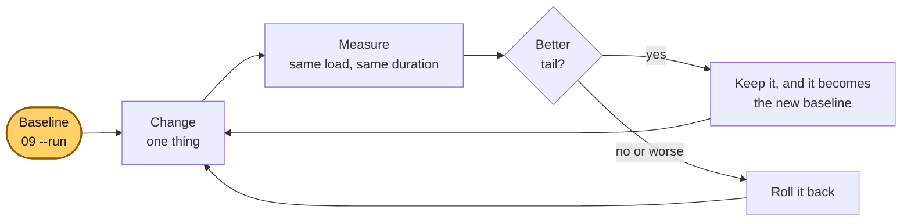
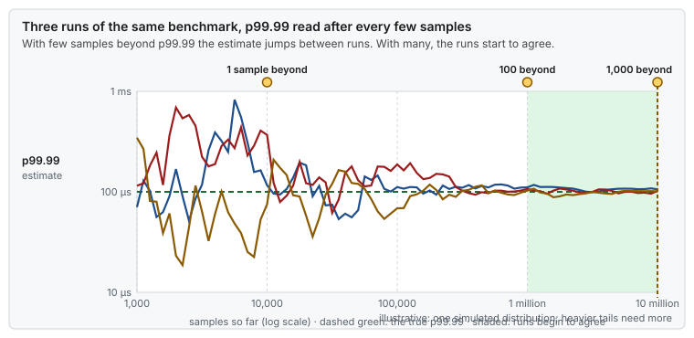
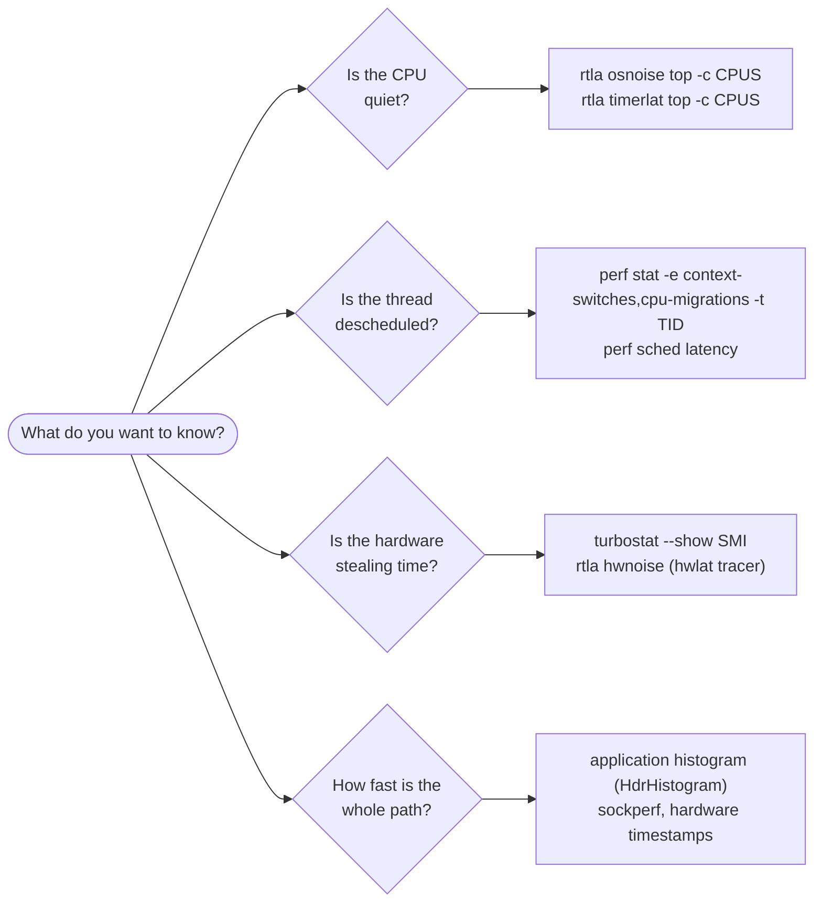
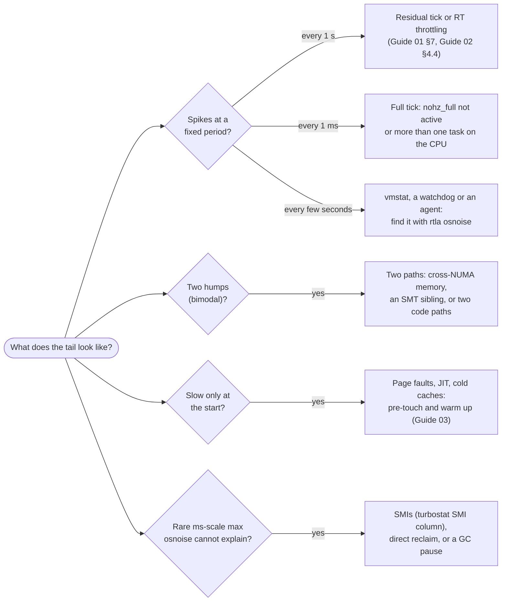
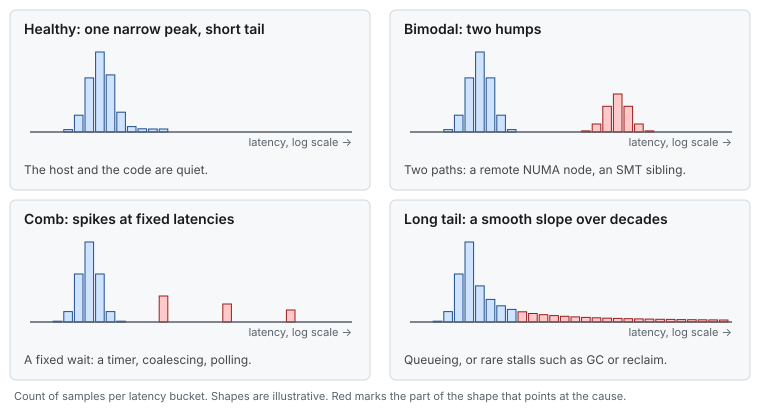
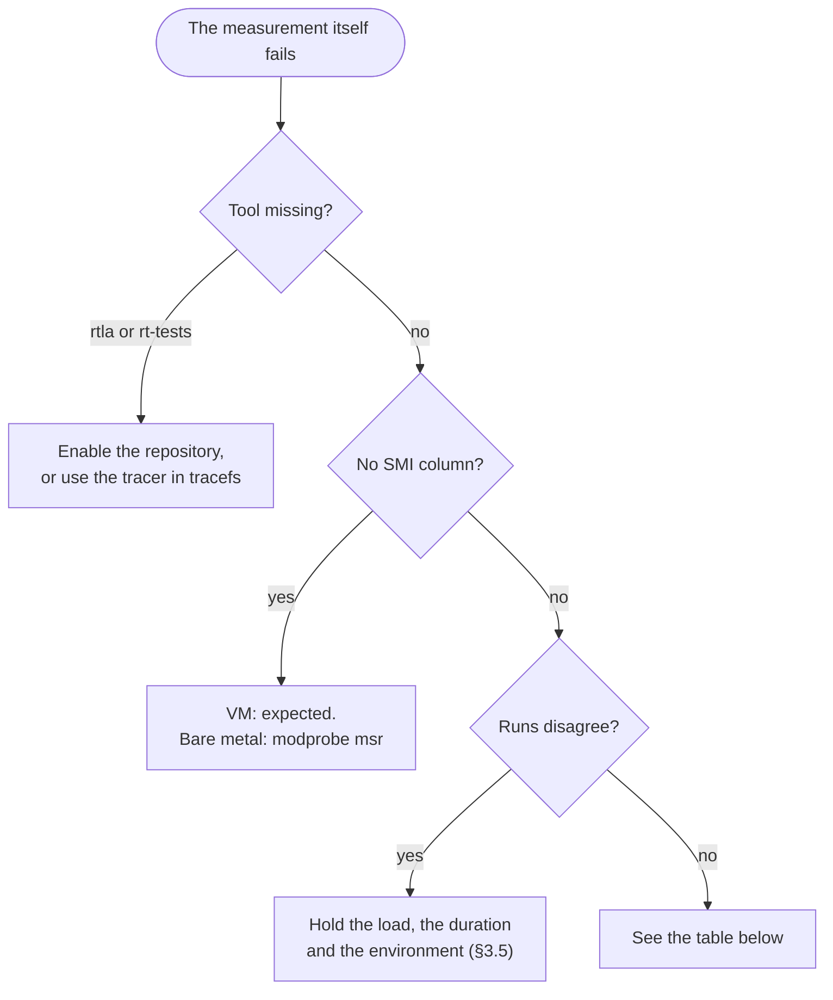

# Guide 09 — Measuring Latency

> **Script:** [`scripts/09-measure-latency`](../scripts/09-measure-latency) · **Concepts:** [cpu-isolation §8](../concepts/cpu-isolation.md#8-measuring-noise), [network-tuning §10](../concepts/network-tuning.md#10-measuring) · **Example:** [Java latency probe](../examples/hugepages-java-example.md) · **Previous:** [Guide 08](08-kernel-bypass.md) · **Next:** [Guide 10 — Time synchronization](10-time-sync.md) · **Use it:** before [Guide 00](00-bios-firmware.md), and after every guide · **Terms:** [Glossary](../GLOSSARY.md)

| | |
|---|---|
| **Risk level** | **1 / 5**. Nothing here changes the tuning. `--run` loads the CPUs it measures for a minute, so never point it at CPUs the application is using. |
| **Reboot required** | No |
| **Applies to** | Bare metal and VMs. Hardware-noise and SMI measurements are meaningful on bare metal only. |
| **Time** | 15 min to install and capture the first bundle. Then about 5 min per measurement. |

## At a glance

- **What:** a repeatable way to measure a host and an application, before and after each change: the same tools, the same load and duration, and the results kept side by side.
- **Why:** "verified" only means the configuration is in place. Only a measurement shows that latency improved, and only a baseline tells you by how much.
- **Cost:** a few packages, a minute of load on the measured CPUs, and the discipline to change one thing at a time.

**Time:** ~15 min for the first baseline, then minutes per run · **Do this if:** always, first · **Skip if:** never. Without a baseline, every later guide is guesswork.



*Measure first, then change one thing at a time, measure the same way again, and keep only what improves the tail.*

---

## 1. Why measure, and what "better" means

Every other guide ends with a verification section. Those checks prove the **configuration**: the CPU list reached the kernel, the NIC has coalescing 0, and the pool exists on node 1. They do not prove that **latency** improved. Only measurement answers:

- Did the tail (p99.9, max) actually move, and by how much?
- Did something get **worse**? For example, throughput on a bulk link, or the median of a thread that makes many syscalls under `nohz_full`.
- Is the remaining noise explainable, or is there a source nobody has found yet?

**Better** here almost always means a **shorter tail**, not a lower average. A change that moves p50 from 6 to 5 µs but p99.9 from 40 to 80 µs is a regression.

## 2. When to measure

| Moment | What to capture | Why |
|---|---|---|
| Before any tuning | A full bundle (§6) plus the application's own histogram under representative load | The **baseline** every later result is compared with |
| After each guide | The same bundle and histogram | Attributes each improvement or regression to one change |
| New host of a known model | The bundle only | Acceptance test: it should match the reference host |
| After a kernel, firmware, BIOS or driver update | The bundle and histogram | Updates reset boot arguments, re-enable C-states, add SMIs |
| During an incident | `rtla osnoise` on the affected CPUs, and `/proc/interrupts` deltas | Finds the new noise source while it is still there |

## 3. What to record

### 3.1 Percentiles, not averages

A latency distribution is long-tailed. The mean mixes the common fast case with the rare slow one and describes neither. Record **p50, p90, p99, p99.9, p99.99 and max**, and keep the whole histogram if you can.

| Statistic | What it tells you |
|---|---|
| p50 (median) | The code path itself: instructions, caches, the NIC |
| p99 | Frequent interference: IRQs on the wrong CPU, cross-NUMA memory, coalescing |
| p99.9 / p99.99 | Rare interference: ticks, kworkers, RCU batches, page faults, C-state exits |
| max | The worst single event: SMIs, direct reclaim, RT throttling, a GC pause |

### 3.2 Enough samples

A percentile is only as good as the number of samples beyond it. With 10,000 samples, p99.99 is one single sample. To trust it you want about **100 samples beyond it** (a million in total), and about 1,000 beyond it is comfortable ([tail latency §3](../concepts/tail-latency.md#3-what-a-percentile-is)). That fixes the rank of the percentile to about ±10 % and ±3 %; how far the value itself moves depends on the shape of the tail, so compare repeated runs. Run long enough to cover the periodic events you are hunting. The residual tick is once per second, and some housekeeping timers run every few seconds, so a 10-second run can miss them entirely.

| Target | Usable (~100 beyond it) | Comfortable (~1,000 beyond it) |
|---|---|---|
| p99 | 10,000 | 100,000 |
| p99.9 | 100,000 | 1,000,000 |
| p99.99 | 1,000,000 | 10,000,000 |



*Before about a million samples, p99.99 rests on a handful of samples and every run tells a different story. After it, the runs begin to agree. The curves come from one simulated distribution; a heavier or multimodal tail needs more samples.*

> [!NOTE]
> **Validate on your hardware.** These sample counts are a starting point. Repeat the run: when p99.99 changes little between runs, you have enough samples for your distribution.

> **Picture it.** A p99.99 from 10,000 samples is a poll with one answer: whatever that one person says is the result. A hundred answers make a poll you can quote.

### 3.3 Coordinated omission

A **closed-loop** benchmark sends a request, waits for the response, and only then sends the next one. When the system stalls for 10 ms, the benchmark also stalls, so it records **one** slow sample instead of the hundreds of requests that would have arrived and waited during those 10 ms in real life. The tail looks far better than users would experience. That is **coordinated omission**.


*One stall, two senders: the closed loop hides the queue behind the stall, and the open loop records every request that was due.*

Two ways to avoid it:

- **Open-loop load.** Send at a fixed rate, whatever the response time, and measure each message from its **intended** send time, not its actual one.
- **Correct the histogram.** HdrHistogram's `recordValueWithExpectedInterval(value, interval)` back-fills the samples a stall would have delayed.

The [Java probe](../examples/hugepages-java-example.md) is a closed-loop ping-pong on purpose. Each round trip is a couple of cache-line transfers, so it shows host noise clearly. It is not a model of production traffic, so measure your application with open-loop load as well.

### 3.4 The right clock

Take both readings of a duration from `CLOCK_MONOTONIC` (`System.nanoTime()` in Java), never from the wall clock, which the time daemon can step. A latency between two hosts is only as accurate as the sync between their clocks. [Concept: clocks and time](../concepts/clocks-and-time.md#7-latency-across-two-hosts) gives the numbers.

### 3.5 Record the environment

Two measurements are only comparable if everything except the one change is the same. Keep with every result: the kernel version, `/proc/cmdline`, the BIOS profile, the application build and configuration, the load (rate, message size, duration), the CPUs used, and the `verify-tuning` report. `09-measure-latency --run` writes most of this into the bundle for you.

## 4. The tools, by question



*Four questions, four families of tools: OS noise on a CPU, scheduling of one thread, hardware and firmware interruptions, and end-to-end latency.*

| Tool | Package (RHEL) | Measures | Notes |
|---|---|---|---|
| `rtla osnoise` | `rtla` (RHEL 9, RHEL 8.8+) | Every interruption of a spinning workload on each CPU: its duration and its source (IRQ, softirq, thread, NMI) | The main host-noise tool. It **runs a workload** on the measured CPUs. |
| `rtla timerlat` | `rtla` | Wake-up latency of a timer-driven thread, split into IRQ and thread latency | Answers "how late does a sleeping thread wake up?" |
| `rtla hwnoise` / hwlat tracer | `rtla` | Time stolen with interrupts disabled: SMIs and hardware stalls | Bare metal only. Pair it with `turbostat`. |
| `cyclictest` | `rt-tests` (Real Time or EPEL repository) | Timer wake-up latency histogram, the classic RT benchmark | Needs `SCHED_FIFO`. Never run it on CPUs the application uses. |
| `turbostat` | `kernel-tools` | Frequency, C-state residency, and the **SMI count** per CPU | SMIs are invisible to every other tool |
| `perf stat` / `perf sched` | `perf` | Context switches and migrations of one thread; scheduling delays | `-t <tid>` for a single thread |
| `/proc/interrupts` deltas | none | Which interrupt rows increase on which CPU | `09-measure-latency --run` records them |
| `mpstat -P ALL 1` | `sysstat` | Per-CPU `%irq`, `%soft`, `%steal` | Steal time is the VM signal |
| `sockperf` | EPEL | Network round trip between two hosts | Pin both ends with `taskset` |
| HdrHistogram | a library in your application | The application's own latency, with coordinated-omission correction | The measurement that matters most |


*Why `turbostat` is on the list: the SMI counter is the only tool that notices a stall the operating system cannot see.*

> [!NOTE]
> **Validate on your hardware.** The guide's own measurements use `rtla osnoise`, `/proc/interrupts` deltas, `perf stat` and the application's own histograms. `rtla hwnoise`, `rtla timerlat` and `cyclictest` are listed from their documentation.

## 5. A measurement protocol

1. **Fix the load.** Use the same rate, message size and duration for every run. Prefer open-loop load (§3.3).
2. **Warm up.** Discard the first seconds, or the first N messages, until JIT compilation, page faults and caches have settled. With `-XX:+AlwaysPreTouch` and a pinned JVM, warm-up is short. Without them it can take minutes.
3. **Measure the host first.** Before the application starts, capture a bundle: `sudo scripts/09-measure-latency --run`.
4. **Measure the application.** Record its histogram under the fixed load, for long enough (§3.2).
5. **Change one thing.** Apply one guide, or one setting.
6. **Repeat steps 3 and 4** under the same conditions.
7. **Compare** the percentiles side by side (§7), and keep or roll back the change.

Run the same protocol after every kernel, firmware or driver update: [Guide 11 §6](11-day2-operations.md#6-an-update-routine) turns it into a routine.

Keep a results table per host model. Use this template:

```text
| Run | Change                  | Kernel      | p50 | p99 | p99.9 | p99.99 | max  | osnoise max | SMIs/10s |
|-----|-------------------------|-------------|-----|-----|-------|--------|------|-------------|----------|
| 0   | baseline                | 5.14.0-...  |     |     |       |        |      |             |          |
| 1   | Guide 01 (+ reboot)     |             |     |     |       |        |      |             |          |
| 2   | Guide 02                |             |     |     |       |        |      |             |          |
```

## 6. Using the script

```bash
sudo scripts/09-measure-latency --dry-run      # what --apply would install
sudo scripts/09-measure-latency --apply        # installs missing tools, creates /var/lib/lowlat/measurements
sudo scripts/09-measure-latency --run          # one bundle: before the application starts
scripts/09-measure-latency --verify            # tools present, at least one bundle
```

A bundle is a directory named after its timestamp under `/var/lib/lowlat/measurements/`:

| File | Content |
|---|---|
| `host.txt` | Date, kernel, host class, measured CPUs, `/proc/cmdline` |
| `lscpu.txt` | CPU topology |
| `verify-tuning.txt` | The full configuration report |
| `interrupts-delta.txt` | Interrupt rows that increased on the measured CPUs over 10 s, with the increase per CPU |
| `turbostat.txt` | Frequency and SMI count per CPU over 10 s |
| `osnoise.txt` | `rtla osnoise top` summary per CPU over `MEASURE_DURATION` seconds |

`lowlat.conf` settings:

| Key | Default | Meaning |
|---|---|---|
| `MEASURE_PACKAGES` | `rtla rt-tests sysstat perf kernel-tools numactl` | What `--apply` installs when missing |
| `MEASURE_CPUS` | empty, meaning `ISOLATED_CPUS` | CPUs `--run` measures |
| `MEASURE_DURATION` | `60` | Seconds of `rtla osnoise` per bundle |

> [!WARNING]
> `rtla osnoise` runs its own workload on every measured CPU. Capture bundles before the application starts, or set `MEASURE_CPUS` to CPUs the application does not use.

## 7. Reading the results

Look at the **shape** first, then the numbers. [Concept: tail latency](../concepts/tail-latency.md#7-reading-the-shape) explains the statistics behind this section and what each histogram shape means.



*Periodic spikes point at timers, two humps at two different paths, a slow start at faults and warm-up, and a rare unexplained max at firmware or memory reclaim.*



*The shape names the cause before any number does. [Concept: tail latency §7](../concepts/tail-latency.md#7-reading-the-shape) goes through each one.*

| Pattern | Likely cause | Where to fix it |
|---|---|---|
| p99.9 spike once per second | Residual tick, or RT throttling (50 ms) with a FIFO spinner | [Guide 01 §7](01-grub-bootloader-tuning.md#7-verification), [Guide 02 §4.4](02-cpu-core-isolation.md#44-real-time-throttling) |
| Noise every 1 ms | The full tick: `nohz_full` missing, or a second runnable task | [Guide 01](01-grub-bootloader-tuning.md), [Guide 02 §8](02-cpu-core-isolation.md#8-verification) |
| `osnoise` shows IRQ time on an isolated CPU | A NIC or device IRQ landing there | [Guide 04 §6](04-network-optimization.md#6-interrupt-affinity-set_nic_irq_affinity) |
| `osnoise` shows thread time (`kworker`, agents) | Workqueues or agents on the CPU | [Guide 02 §4.2](02-cpu-core-isolation.md#42-unbound-kernel-workqueues-runtime), [Guide 05](05-cgroup-isolation.md) |
| Bimodal histogram | Some samples cross NUMA nodes, or share a core with an SMT sibling | [Guide 02 §3](02-cpu-core-isolation.md#3-designing-the-cpu-layout), [Guide 03 §5.3](03-huge-pages-configuration.md#53-make-sure-the-pages-come-from-the-right-node) |
| Rare max of hundreds of µs, `osnoise` clean | SMIs (check the `turbostat` SMI column), or firmware power management | [Guide 00 §4.6](00-bios-firmware.md#46-system-management-interrupts) |
| Random-read tail much worse than p50 | TLB misses on a large working set | [Guide 03](03-huge-pages-configuration.md) |
| Slow first minutes | Page faults, JIT compilation, cold caches | [Guide 03 §5](03-huge-pages-configuration.md#5-java-applications) |

A good isolated CPU under `rtla osnoise` shows single-digit µs of maximum noise over hours, and every remaining event is explainable.

## 8. Verification

```bash
scripts/09-measure-latency --verify                      # tools installed, at least one bundle
ls -1 /var/lib/lowlat/measurements/                      # one directory per bundle
cat /var/lib/lowlat/measurements/<stamp>/osnoise.txt     # MAX SINGLE NOISE per CPU
```

`scripts/verify-tuning` includes these checks as WARN-only: a host without measurement tools is not misconfigured, just unmeasured.

## 9. Troubleshooting



*Start from what failed: a missing tool, a missing counter, or results that change between runs.*

| Symptom | Cause | Fix |
|---|---|---|
| `dnf install rtla` fails | RHEL 8 before 8.8, or the repository is not enabled | Use the osnoise tracer directly (`/sys/kernel/tracing`), or upgrade |
| `dnf install rt-tests` fails | `rt-tests` lives in the Real Time or EPEL repository | Enable one, or skip `cyclictest`: `rtla timerlat` covers the same question |
| `rtla: tracefs not mounted` | tracefs not mounted | `mount -t tracefs nodev /sys/kernel/tracing` |
| `turbostat` shows no `SMI` column | VM, or a CPU without the SMI counter (a model-specific register, MSR) | Expected in VMs. On bare metal, load `msr` (`modprobe msr`). |
| The application's latency got worse during `--run` | `osnoise` ran on the application's CPUs | Measure before the application starts, or set `MEASURE_CPUS` |
| Results differ a lot between runs | The load, duration or environment changed | §3.5: record and hold everything but the one change |

## 10. Rollback

- [ ] Remove only the packages this script installed: `sudo scripts/09-measure-latency --rollback`
- [ ] Keep `/var/lib/lowlat/measurements/`: bundles are your history. Delete them by hand if you must.

## 11. Bare metal vs VM

| | Bare metal | VM |
|---|---|---|
| `rtla osnoise`, `timerlat`, `/proc/interrupts` | ✅ | ✅, but they include time the hypervisor steals |
| SMI count, `hwnoise` | ✅ | ❌ The guest cannot see firmware events |
| Steal time (`mpstat` `%steal`) | not applicable | ✅ The most important VM signal: time your vCPU wanted to run but the host did not let it |
| Application histograms | ✅ | ✅ |

## 12. Key takeaways

- Take a baseline before you change anything, and measure after every change, the same way each time.
- Compare the tail (p99.9, p99.99, max), not the average, with enough samples to trust it.
- Avoid coordinated omission: use open-loop load, or correct the histogram.
- `rtla osnoise` finds OS noise, and `turbostat` finds SMIs. Never run either on CPUs the application is using.
- The shape of the histogram points at the cause: periodic spikes mean timers, two humps mean two paths.

## 13. References

- `rtla`: <https://docs.kernel.org/tools/rtla/index.html>, and the osnoise tracer: <https://docs.kernel.org/trace/osnoise-tracer.html>
- hwlat tracer: <https://docs.kernel.org/trace/hwlat_detector.html>
- `man 8 turbostat`, `man 1 perf-stat`, `man 1 perf-sched`, `man 8 cyclictest`
- Gil Tene, "How NOT to Measure Latency" (talk), on coordinated omission
- HdrHistogram: <https://hdrhistogram.github.io/HdrHistogram/>
- Brendan Gregg, *Systems Performance*, 2nd ed., chapter 2 (methodologies)
