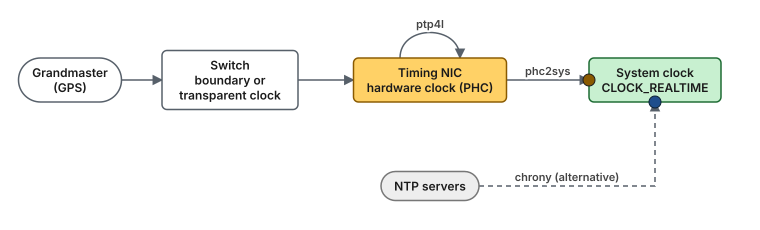
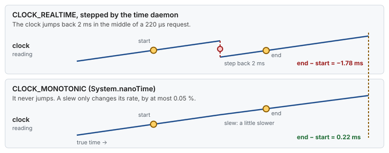
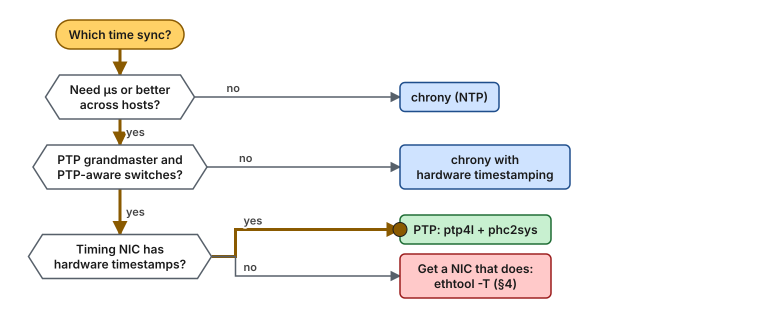
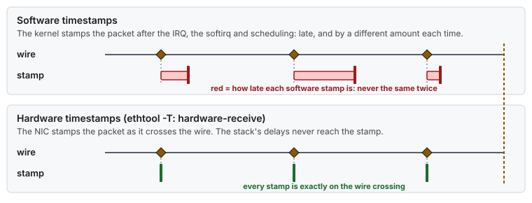
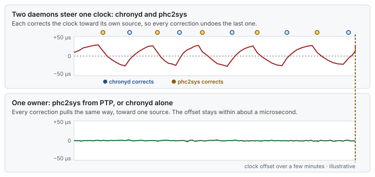
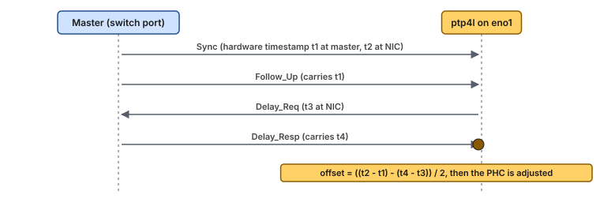
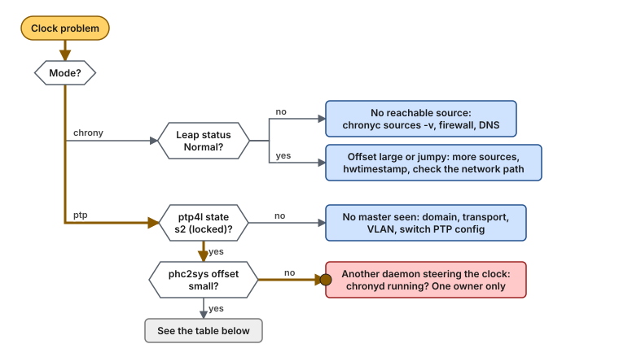

# Guide 10 — Time Synchronization (chrony and PTP)

> **Script:** [`scripts/10-time-sync`](../scripts/10-time-sync) · **Concepts:** [ethtool §12 (timestamping)](../concepts/ethtool.md#12--t-timestamping), [network-tuning](../concepts/network-tuning.md) · **Example:** [segmentation §7 (PTP on the timing NIC)](../examples/network-segmentation-example.md#7-ptp-on-the-timing-nic) · **Previous:** [Guide 07](07-os-hygiene.md), or [Guide 08](08-kernel-bypass.md) with a bypass stack · **Builds on:** [Guide 04](04-network-optimization.md) (the `timing` NIC role) · **Next:** [Guide 11 — Day-2 operations](11-day2-operations.md) · **Terms:** [Glossary](../GLOSSARY.md)

| | |
|---|---|
| **Risk level** | **2 / 5**. A wrong setup leaves the clock drifting or stepping. Switching between chrony and PTP briefly leaves the clock undisciplined. |
| **Reboot required** | No |
| **Applies to** | Bare metal: chrony or PTP. VMs: chrony, preferably from the hypervisor's clock (§12). |
| **Time** | 15 min for chrony. 1 h for PTP, most of it confirming the network side with the network team. |

## At a glance

- **What:** keep the system clock synchronized, with chrony (NTP) or with PTP from a grandmaster through the timing NIC's hardware clock, and keep the time daemons on a housekeeping CPU.
- **Why:** comparable timestamps across hosts, one-way latency measurements, audit trails that hold up, and no clock steps in the middle of a session.
- **Cost:** a dedicated `timing` NIC for PTP, switch support (boundary or transparent clocks), and one more daemon to monitor.

**Time:** 15 min (chrony) to 1 h (PTP) · **Do this if:** always, on every host · **Skip if:** never. Even a VM needs a disciplined clock.



*With PTP, ptp4l disciplines the NIC's hardware clock from the grandmaster, and phc2sys steers the system clock from the NIC clock. With chrony, the system clock follows NTP servers directly.*

---

## 1. Why time synchronization matters here

A latency-critical host needs a good clock for three reasons:

- **Comparable timestamps.** Request, event and audit timestamps from different hosts must line up, or distributed traces, logs and event ordering across hosts stop making sense. Some industries also require traceable timestamps with a stated accuracy.
- **Measurement.** A one-way latency between two hosts (host A stamps, host B stamps) is only as accurate as the offset between their clocks. With NTP-level sync (tens of µs to ms), one-way numbers below that are noise.
- **No surprises.** A clock **step** (a jump) breaks timeouts and makes durations negative. A **slew** (small rate adjustment) does not. Configure the daemon to step only at boot.



*A step moves the wall clock while a request is running, and the measured duration comes out negative. The monotonic clock is never stepped, which is why durations use it.*

> **Picture it.** Slewing is a driver easing off the gas to match the car ahead. Stepping is the car jumping forward by teleport: the trip computer stops making sense.

The time daemons also matter for **noise**. They wake up periodically, take interrupts for timestamped packets, and must not do that on an isolated CPU.

## 2. Clocks in Linux, briefly

[Concept: clocks and time](../concepts/clocks-and-time.md) goes deeper: the TSC flags, the clocksource watchdog, every clock ID, steps and slews, and what a one-way latency across hosts can and cannot show.

| Clock | What it is | Use |
|---|---|---|
| TSC | CPU cycle counter, invariant on current CPUs | The `tsc` clocksource behind `clock_gettime()` via the vDSO: tens of ns, no syscall |
| `CLOCK_REALTIME` | Wall-clock time, disciplined by chrony or phc2sys | Timestamps |
| `CLOCK_MONOTONIC` | Never jumps, slewed with REALTIME | Durations, timeouts |
| PHC (`/dev/ptpN`) | The NIC's own hardware clock | Hardware timestamps, disciplined by ptp4l |

`verify-tuning` checks that the clocksource is `tsc`. Another clocksource (`hpet`, `acpi_pm`) makes every `clock_gettime()` a slow hardware read.

## 3. chrony or PTP?

| | chrony (NTP) | chrony + hardware timestamping | PTP (ptp4l + phc2sys) |
|---|---|---|---|
| Typical accuracy | tens of µs to ms | µs | sub-µs, with PTP-aware switches |
| Needs | NTP servers | a NIC with hardware timestamping | a grandmaster, PTP-aware switches, a NIC with hardware timestamping |
| Complexity | low | low | medium: network design and monitoring |
| Choose it when | the host only needs sane wall-clock time | you need µs, but the network has no PTP | you timestamp events across hosts, or regulation asks for sub-100 µs traceability |



*Plain chrony when wall-clock time is enough, chrony with hardware timestamping for microseconds without a PTP network, and PTP when you have the grandmaster, the switches and the NIC.*

## 4. Hardware timestamping

```bash
ethtool -T eno1
#   Capabilities: hardware-transmit, hardware-receive, hardware-raw-clock
#   PTP Hardware Clock: 0            <- /dev/ptp0
#   Hardware Receive Filter Modes: all (or ptpv2-event ...)
```

`hardware-transmit` and `hardware-receive` mean the NIC stamps packets as they cross the wire, so neither the stack's scheduling nor its interrupt latency ends up in the timestamp. Without them, PTP falls back to software timestamps and loses most of its advantage, and the script refuses `TIME_SYNC_MODE=ptp`.



*A software stamp includes the interrupt, softirq and scheduling delay, which changes with every packet. A hardware stamp is taken on the wire, so that noise never reaches the clock.*

## 5. Placement: the timing NIC and the daemon CPUs

- **The `timing` NIC role** ([Guide 04 §3](04-network-optimization.md#3-network-segmentation-give-each-traffic-class-its-own-nic)) carries PTP only. It gets the critical profile (coalescing 0, no PAUSE), so event messages are timestamped and processed promptly.
- **Its interrupts go to a housekeeping CPU** (CPU 0 on the reference host), never to an isolated one.
- **The daemons run on that same housekeeping CPU** (`TIME_SYNC_CPUS`), through a systemd drop-in with `CPUAffinity=`. Not in `housekeeping.slice`: the daemon's own scheduling latency adds to the clock error, so it must not share a CPU quota with agents.

## 6. chrony

The script enables `chronyd`, stops `ptp4l` and `phc2sys`, and pins `chronyd`. Two daemons must never steer one clock:



*Two owners pull the clock toward two sources, and every correction undoes the last one. One owner keeps it flat. The numbers are illustrative.*

The server list stays yours: `/etc/chrony.conf` is site-specific.

**Precheck.** In chrony mode, the script checks for `chronyc` and the `chronyd.service` unit before it writes anything. If one is missing, it stops with exit code 3 and changes nothing: run `dnf install chrony` and try again. In PTP mode, the hardware timestamping check runs later, after the CPU drop-ins are written, so after a failed PTP check run `--rollback` ([SAFETY.md](../SAFETY.md)). Set `TIME_SYNC_MODE=""` only when another service manages the clock.

Settings worth checking in `/etc/chrony.conf`:

| Directive | Recommended | Why |
|---|---|---|
| `server` / `pool` | Several internal servers, `iburst` | Fast first sync, and no single point of failure |
| `makestep 1 3` | The RHEL default | Step only during the first 3 updates, at boot. After that, only slew. |
| `hwtimestamp <iface>` | On the NIC facing the NTP servers, if it supports hardware timestamps | Takes the stack's delays out of the measurement: µs instead of tens of µs |
| `rtcsync` | The RHEL default | Keeps the hardware RTC close, for the next boot |

> [!NOTE]
> **Validate on your hardware.** `hwtimestamp` with chrony follows the chrony documentation. Check the improvement with `chronyc sourcestats` before relying on it.

## 7. PTP with linuxptp

`TIME_SYNC_MODE=ptp` configures the two daemons the RHEL `linuxptp` package ships:

| Daemon | Job | Configured by the script |
|---|---|---|
| `ptp4l` | Runs the PTP protocol on the timing NIC and disciplines its hardware clock from the grandmaster | `/etc/sysconfig/ptp4l`: `OPTIONS="-f /etc/ptp4l.conf -i <PTP_INTERFACE>"` |
| `phc2sys` | Copies the NIC's hardware clock into the system clock | `/etc/sysconfig/phc2sys`: `OPTIONS="-a -r"`, automatic configuration from ptp4l, steering `CLOCK_REALTIME` |

`chronyd` is stopped, because `phc2sys` now owns the system clock.

`/etc/ptp4l.conf` stays yours. The profile (domain number, delay mechanism E2E or P2P, transport L2 or UDP, message intervals) must match the grandmaster and the switches. Agree it with the network team. Keep `time_stamping hardware`, which is the default.



*Four timestamps give the path delay and the offset, assuming the path is symmetric. With PTP-aware switches, each hop corrects for its own residence time.*

## 8. Using the script

```bash
scripts/10-time-sync --dry-run
sudo scripts/10-time-sync --apply
scripts/10-time-sync --verify
```

| `lowlat.conf` key | Default | Meaning |
|---|---|---|
| `TIME_SYNC_MODE` | `chrony` | `chrony`, `ptp`, or empty to leave time synchronization alone |
| `PTP_INTERFACE` | empty: the first `NICS` entry with role `timing` | The NIC for ptp4l |
| `TIME_SYNC_CPUS` | `(0)` | CPUs for chronyd, ptp4l and phc2sys: a housekeeping CPU |

`apply-all --apply` runs it after Guide 07. `verify-tuning` includes it as "10 Time synchronization", and its host-wide section still checks that the clock is synchronized at all.

## 9. Verification

```bash
scripts/10-time-sync --verify

# chrony
chronyc tracking            # Leap status: Normal; System time: offset; Frequency, Skew
chronyc sources -v          # '*' marks the selected source
chronyc sourcestats         # offset and standard deviation per source

# PTP
systemctl status ptp4l phc2sys
journalctl -u ptp4l -n 20   # "master offset" lines: small and stable, state s2 (locked)
journalctl -u phc2sys -n 20 # "CLOCK_REALTIME phc offset": small and stable
pmc -u -b 0 'GET CURRENT_DATA_SET'   # offsetFromMaster, meanPathDelay

# Either
grep Cpus_allowed_list /proc/$(pgrep -x chronyd || pgrep -x ptp4l)/status   # TIME_SYNC_CPUS
cat /sys/devices/system/clocksource/clocksource0/current_clocksource       # tsc
```

## 10. Troubleshooting



*chrony problems are usually unreachable sources or a noisy path. PTP problems are usually a profile mismatch with the switches, or two daemons fighting over the system clock.*

| Symptom | Cause | Fix |
|---|---|---|
| `TIME_SYNC_MODE=ptp` refused: no hardware timestamping | The timing NIC cannot timestamp | Use a NIC that can, or `TIME_SYNC_MODE=chrony` |
| ptp4l stays in LISTENING, no master | Domain, transport (L2/UDP) or delay mechanism differ from the network, or the VLAN is wrong | Match `/etc/ptp4l.conf` to the switch configuration |
| Offset swings by µs every few seconds | The daemon's CPU is busy (agents, IRQ storms) | Keep `TIME_SYNC_CPUS` quiet; not in `housekeeping.slice` (§5) |
| Clock steps during the day | chrony `makestep` without a limit, or a manual `date` | `makestep 1 3`; never set the clock by hand on a running host |
| phc2sys and chronyd both running | Mixed configuration | One owner of the system clock: the script stops the other one |
| `clock_gettime()` slow | Clocksource not `tsc` (unstable TSC reported at boot) | `dmesg | grep -i tsc`; firmware or BIOS issue ([Guide 00](00-bios-firmware.md)) |

## 11. Rollback

- [ ] Remove the drop-ins, and for PTP stop ptp4l and phc2sys and restore their sysconfig files: `sudo scripts/10-time-sync --rollback`
- [ ] Set `TIME_SYNC_MODE=""` in `lowlat.conf`, so that `apply-all` leaves time synchronization alone
- [ ] Confirm chrony is back: `chronyc tracking`

The rollback re-enables `chronyd`, the RHEL default. If the host ran something else before (for example a vendor PTP stack), restore that by hand.

## 12. Bare metal vs VM

| | Bare metal | VM |
|---|---|---|
| chrony (NTP) | ✅ | ✅ |
| PTP with ptp4l on a NIC | ✅ | Only with an SR-IOV VF or passthrough NIC that exposes its hardware clock |
| Hypervisor clock | not applicable | ✅ Best option: the `ptp_kvm` device on KVM (a PHC backed by the host's clock), used by chrony as a `refclock PHC /dev/ptp0` |
| Pinning the daemon | ✅ | ✅ (inside the guest) |

> [!NOTE]
> **Validate on your hardware.** The `ptp_kvm` approach follows the kernel and chrony documentation. It depends on the host itself being synchronized.

## 13. Key takeaways

- Every host needs a disciplined clock: chrony for sane wall-clock time, PTP with hardware timestamps for sub-µs across hosts.
- Only one daemon owns the system clock: chronyd, or phc2sys.
- Step at boot only, then slew.
- PTP needs the whole path: a grandmaster, PTP-aware switches, and a timing NIC with hardware timestamps. Agree the profile with the network team.
- Keep the time daemons and the timing NIC's interrupts on a quiet housekeeping CPU, never an isolated one.

## 14. References

- Red Hat — *Configuring basic system settings*: "Using the Chrony suite" and "Configuring PTP using ptp4l"
- `man 5 chrony.conf`, `man 8 ptp4l`, `man 8 phc2sys`, `man 8 pmc`
- linuxptp: <https://linuxptp.sourceforge.net/>
- Kernel timestamping: <https://docs.kernel.org/networking/timestamping.html>, PTP hardware clocks: <https://docs.kernel.org/driver-api/ptp.html>
- IEEE 1588-2019 (PTP)
