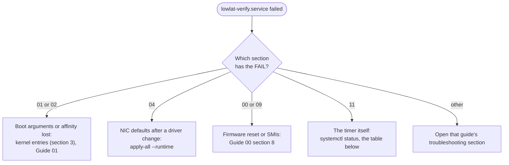

# Guide 11 — Day-2 Operations: Keeping a Host Tuned

> **Script:** [`scripts/11-day2-operations`](../scripts/11-day2-operations) · **Previous:** [Guide 10 — Time synchronization](10-time-sync.md) · **Measure with:** [Guide 09](09-measuring-latency.md) · **Story:** [Capstone use case](../examples/use-cases/08-stock-to-tuned-in-one-afternoon.md)

| | |
|---|---|
| **Risk level** | **1 / 5**. The timer runs the read-only report. Nothing else changes. |
| **Reboot required** | No |
| **Applies to** | Bare metal and VMs (the report checks what applies to the host class) |
| **Depends on** | Guides 00 to 10 applied: the report checks them |
| **Time** | 20 min to install and read the first report. The update routine is a habit, not a task. |

## At a glance

- **What:** turn "tuned once" into "stays tuned": a timer that runs `verify-tuning` daily and after every boot, a check that every installed kernel carries the isolation arguments, a short list of signals worth alerting on, and a routine for updates and for adding a thread.
- **Why:** tuning drifts silently. A kernel update installs an entry without your arguments, a firmware update resets the BIOS, a driver reload restores NIC defaults, an agent update resets its affinity. Each one shows up weeks later as a worse tail, with no change in the application.
- **Cost:** one short oneshot job a day on the OS CPUs, and the discipline of a canary host for updates.

**Time:** 20 min · **Do this if:** always, after Guides 00 to 10 · **Skip if:** the host is throwaway.


*A change makes one setting revert, the timer's report catches it within a day (or ten minutes after the next boot), a FAIL leaves the unit failed, and your alerting picks that up.*

---

## 1. Why tuning drifts

Guides 00 to 10 set things once. The host then keeps changing under them:

| Event | What can silently revert | How you notice | Where the fix is |
|---|---|---|---|
| **Kernel update** | The new kernel entry boots without `isolcpus`, `nohz_full` or `rcu_nocbs` | `grubby --info=ALL`, or `/sys/devices/system/cpu/isolated` empty after the reboot | §3 and [Guide 01](01-grub-bootloader-tuning.md#7-verification) |
| **BIOS or BMC firmware update** | BIOS settings back to vendor defaults: C-states, turbo, Hyper-Threading, SMI sources | `scripts/00-bios-firmware --verify`, and the SMI count | [Guide 00 §8](00-bios-firmware.md#8-troubleshooting) |
| **NIC driver or firmware update, driver reload** | Queues, coalescing, offloads and IRQ affinity go back to defaults | `scripts/04-network --verify` | [Guide 04 §11](04-network-optimization.md#11-troubleshooting), and `sudo scripts/apply-all --runtime` |
| **Agent update** (endpoint security, monitoring) | The agent resets its own affinity and leaves the fence | Where every thread of each agent runs | [Guide 05 §7](05-cgroup-isolation.md#7-troubleshooting) |
| **Package updates of tuned or sysctl files** | The order in which profiles and `sysctl.d` files apply | `scripts/06-kernel-sysctl --verify` | [Guide 07 §5](07-os-hygiene.md#5-tuned-profile) |
| **Application release** | New threads, or changed pinning | `show_affinity` of the running process | §5 |
| **Hardware swap** | CPU and NUMA numbering | `scripts/plan-layout --check` | [Guide 02 §3](02-cpu-core-isolation.md#3-designing-the-cpu-layout) |

Every row has a command that answers "did it revert?". This guide runs the ones a script can run, and lists the rest.

## 2. The verification timer

`sudo scripts/11-day2-operations --apply` (or `apply-all`) installs two units:

- `lowlat-verify.service`, a **oneshot** that runs `scripts/verify-tuning --report /var/lib/lowlat/reports/verify-latest.txt`. It starts on the OS CPUs (`CPUAffinity=` from `OS_CPUS`), at nice 19 and idle I/O priority, so it does not compete with the application for CPU or disk.
- `lowlat-verify.timer`, which fires **10 minutes after every boot** (long enough for `lowlat-runtime.service` to have re-applied the runtime settings) and on `DAY2_VERIFY_SCHEDULE` (default `daily`), with up to 15 minutes of random delay so that a fleet does not run at once.

`verify-tuning` exits with status 5 when a check **FAILs**, and 0 for PASS and WARN. That maps onto systemd like this:

| Report | Unit state | What you do |
|---|---|---|
| All PASS | inactive (dead), last run successful | nothing |
| PASS with WARN | inactive (dead), last run successful | read the WARN lines at your next visit |
| At least one FAIL | **failed** | `systemctl --failed` lists it, and `journalctl -u lowlat-verify` has the report |

<details>
<summary><b>The two units the script writes</b></summary>

`/etc/systemd/system/lowlat-verify.service` (reference host, `OS_CPUS` from `lowlat.conf`):

```ini
[Unit]
Description=Verify the low-latency tuning (read-only report)
ConditionPathExists=/etc/lowlat/lowlat.conf

[Service]
Type=oneshot
Environment=LOWLAT_CONFIG=/etc/lowlat/lowlat.conf
ExecStartPre=/usr/bin/mkdir -p /var/lib/lowlat/reports
ExecStart=/opt/lowlat/scripts/verify-tuning --report /var/lib/lowlat/reports/verify-latest.txt
SyslogIdentifier=lowlat-verify
Nice=19
IOSchedulingClass=idle
CPUAffinity=0 1 2 4 6 8 10 12 14 16 18 20 22 24 26 28 30
```

`/etc/systemd/system/lowlat-verify.timer`:

```ini
[Unit]
Description=Verify the low-latency tuning on a schedule

[Timer]
OnBootSec=10min
OnCalendar=daily
Persistent=true
RandomizedDelaySec=15min

[Install]
WantedBy=timers.target
```

</details>

Read the result:

```bash
systemctl list-timers lowlat-verify.timer      # next and last run
systemctl status lowlat-verify.service         # result of the last run
journalctl -u lowlat-verify -n 80 --no-pager   # the full report of the last run
cat /var/lib/lowlat/reports/verify-latest.txt  # the same, as a file
```

> [!WARNING]
> The report includes a one-second `turbostat` sample of the SMI count ([Guide 00 §7](00-bios-firmware.md#7-verification)). `turbostat` reads counters from every CPU, so it visits the isolated CPUs briefly. It is a read, not a workload, but if even that is unacceptable during business hours, set `DAY2_VERIFY_SCHEDULE` to a maintenance window.

The unit's own state is the alert. The "last run did not fail" line of `--verify` cannot see the run that is in progress, so read it from `systemctl`, or from a manual `scripts/11-day2-operations --verify` between runs.

## 3. Kernel updates

`isolcpus`, `nohz_full` and `rcu_nocbs` live in the boot loader entries ([Guide 01](01-grub-bootloader-tuning.md)). Installing a kernel creates a new entry, and whether that entry inherits your arguments depends on the RHEL minor version and on how the kernel was installed. **Check it instead of assuming it**, before the reboot:

```bash
grubby --default-kernel                          # the entry the next boot uses
grubby --info=ALL | grep -E '^(kernel|args)='    # every entry and its arguments
# expect: every kernel line (the rescue entry aside) has args with isolcpus=, nohz_full= and rcu_nocbs=
```

The script's `all_kernel_entries_isolated` check does exactly this (it skips the rescue entry, and wants all three arguments), and `--verify` reports it as a WARN, so a host that has installed a kernel but not rebooted yet already shows it. If a new entry lacks the arguments:

```bash
sudo scripts/01-grub-bootloader --apply          # grubby --update-kernel=ALL: adds them to every entry
sudo grubby --info=DEFAULT                       # check the entry the next boot uses
sudo systemctl reboot
```

> [!NOTE]
> **Not proven in production.** Whether a new kernel inherits the arguments differs between RHEL 8 and 9 and between installation paths, so the check reads the entries and does not model the mechanism. Treat a WARN as a fact about the boot loader, and a clean result as a fact about today's entries.

## 4. What to alert on

The repository does not ship a metrics exporter. Feed your own monitoring with the signals below. Each one comes from a guide, with the healthy value it states. Collect them from a housekeeping CPU: reading `/proc` is cheap, but never pin a collector to an isolated CPU ([Guide 05](05-cgroup-isolation.md)).

| Signal | How to read it | Healthy | Comes from |
|---|---|---|---|
| The verification report | `systemctl is-failed lowlat-verify.service` | not failed | §2 |
| Tick on an isolated CPU | the `LOC` row of `/proc/interrupts`, per second | about 1 per second | [Guide 02 §8](02-cpu-core-isolation.md#8-verification) |
| Device interrupts on an isolated CPU | the NIC rows of `/proc/interrupts` | 0 | [Guide 04 §9](04-network-optimization.md#9-verification) |
| SMI count | `sudo turbostat --quiet --interval 10 --num_iterations 1 --show SMI` | 0, or a small constant count | [Guide 00 §7](00-bios-firmware.md#7-verification) |
| Agents starved by their quota | `nr_throttled` in `/sys/fs/cgroup/housekeeping.slice/cpu.stat` | rising slowly, or not at all | [Guide 05 §6](05-cgroup-isolation.md#6-verification) |
| NIC drops | `ethtool -S <nic> \| grep -iE 'drop\|miss\|discard\|no_buf\|fifo'` | 0 | [Guide 04 §9](04-network-optimization.md#9-verification) |
| Softirq squeeze | the dropped and squeezed columns of `/proc/net/softnet_stat` | not rising | [Guide 04 §9](04-network-optimization.md#9-verification) |
| Huge page pool | `HugePages_Free` per node in `/sys/devices/system/node/node*/hugepages/` | matches the application's footprint | [Guide 03 §8](03-huge-pages-configuration.md#8-verification) |
| Clock offset | `chronyc tracking`, or the `master offset` in `journalctl -u ptp4l` | small, and stable | [Guide 10 §9](10-time-sync.md#9-verification) |

Alert on a **change** more than on a level: a tick rate that doubled, a device interrupt that appeared, an SMI count that started to rise. The slow drift is what this guide is about.

## 5. Adding a thread without re-planning

A new critical thread does not need a reboot as long as the layout has a spare isolated CPU ([Guide 02 §3](02-cpu-core-isolation.md#3-designing-the-cpu-layout), rule 5):

1. Pick the next spare from `ISOLATED_CPUS`, on the critical NIC's node (`scripts/plan-layout --check` tells you if the layout still follows the rules).
2. Add the role to `affinity.properties` ([Guide 02 §6.1](02-cpu-core-isolation.md#61-describe-the-mapping-in-configuration-not-in-code)) and restart the application.
3. Check with `show_affinity` that the thread runs on its CPU alone, and with `rtla osnoise` on that CPU **before** the application uses it ([Guide 09](09-measuring-latency.md)).

When the spares are gone, the layout needs more isolated CPUs. That changes `isolcpus`, which is read at boot: re-plan with `scripts/plan-layout --nic-node N --threads <new total>`, update `lowlat.conf`, apply Guide 01 and reboot. Plan the reboot, because it is the price of not leaving headroom.

## 6. An update routine

> [!NOTE]
> **Not proven in production.** This is a process suggestion, not a measured procedure. The steps are the ones that make the drift in §1 visible.

| Step | Action |
|---|---|
| 1 | Pick one canary host of each hardware model. Capture a host bundle and the application histogram ([Guide 09 §5](09-measuring-latency.md#5-a-measurement-protocol)) |
| 2 | Apply the update to the canary. Read the kernel entries (§3) before the reboot, then reboot |
| 3 | Wait for the 10-minute run of the timer, or run `scripts/verify-tuning` yourself. A FAIL stops the rollout |
| 4 | Capture the same bundle and histogram, and compare them with the baseline. A worse p99.9 with a clean report points at an application or firmware change |
| 5 | Roll out to the rest of the fleet, with the timer as the safety net |

## 7. Using the script

```bash
scripts/11-day2-operations --dry-run            # the two unit files, nothing written
sudo scripts/11-day2-operations --apply         # install and start the timer
scripts/11-day2-operations --verify             # timer state and the kernel entries
sudo scripts/11-day2-operations --rollback      # remove the units and the reports
```

| `lowlat.conf` key | Default | Meaning |
|---|---|---|
| `DAY2_VERIFY_TIMER` | `yes` | `no` leaves the host without the timer: `apply-all` or this script removes one that an earlier run installed |
| `DAY2_VERIFY_SCHEDULE` | `daily` | a systemd `OnCalendar` expression, for example `hourly` or `*-*-* 03:00:00` |

`apply-all --apply` installs the timer as its last persistent step, and `verify-tuning` prints a "11 Day-2 operations" section.

## 8. Verification

```bash
scripts/11-day2-operations --verify
systemctl is-enabled lowlat-verify.timer         # enabled
systemctl list-timers lowlat-verify.timer        # a NEXT time is listed
sudo systemctl start lowlat-verify.service       # run it now
systemctl show -p Result --value lowlat-verify.service    # success (or exit-code after a FAIL)
```

## 9. Troubleshooting



*Read the section header of the first FAIL in the journal. It names the guide that owns the setting, and the guide's own troubleshooting section has the fix.*

| Symptom | Cause | Fix |
|---|---|---|
| `lowlat-verify.service` never runs | The timer is not enabled, or `ConditionPathExists` fails because `/etc/lowlat/lowlat.conf` moved | `systemctl enable --now lowlat-verify.timer`, and check the path in the unit |
| The unit fails on every run with the same section | A real drift, or a check that does not apply to this hardware | Fix the setting, or keep the WARN-level meaning by adjusting `lowlat.conf` (for example an empty `TIME_SYNC_MODE`) |
| `--verify` warns about kernel entries right after an update | The new kernel entry lacks the arguments | §3 |
| The report shows FAIL only in the first minutes after a boot | The runtime service was still applying settings | The 10-minute delay covers this. Raise `OnBootSec` if your NICs take longer |
| The timer's run shows up in the application's latency | The one-second `turbostat` sample visits every CPU, or `OS_CPUS` in `lowlat.conf` wrongly includes an isolated CPU | Move `DAY2_VERIFY_SCHEDULE` to a maintenance window, and check `OS_CPUS` with `scripts/plan-layout --check` |

## 10. Rollback

- [ ] Remove the timer and the units: `sudo scripts/11-day2-operations --rollback`
- [ ] Set `DAY2_VERIFY_TIMER=no` in `lowlat.conf`, so that `apply-all` does not install it again
- [ ] Confirm: `systemctl list-timers lowlat-verify.timer` lists nothing

## 11. Bare metal vs VM

| | Bare metal | VM |
|---|---|---|
| Verification timer | ✅ | ✅ (the report lists what applies to a VM) |
| Kernel entry check | ✅ | Skipped: the isolation arguments are not applied in a guest |
| SMI count and firmware rows | ✅ | ❌ Not visible from a guest. Ask the hypervisor owner for the host's firmware and update routine |

## 12. Key takeaways

- **Tuning is a state, not an event.** Every update can revert one setting, and the effect shows up as a slow slide in the tail.
- **Let the host check itself.** A read-only report after every boot and once a day turns silent drift into a failed unit.
- **Check the boot loader before the reboot.** A new kernel entry without `isolcpus` boots an untuned host.
- **Alert on changes.** A new device interrupt on an isolated CPU is worth more than any absolute number.
- **Leave headroom.** Spare isolated CPUs let you add a thread without a reboot.

## 13. References

- `man 5 systemd.timer`, `man 5 systemd.service`, `man 8 grubby`
- [Guide 09 — Measuring latency](09-measuring-latency.md), for the baseline every comparison needs
- [Guide 01 — Kernel command line](01-grub-bootloader-tuning.md), for the arguments the check looks for
