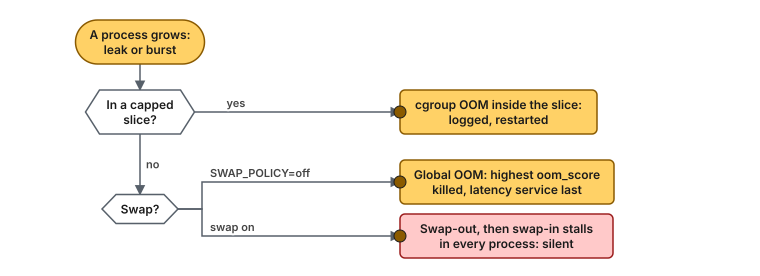
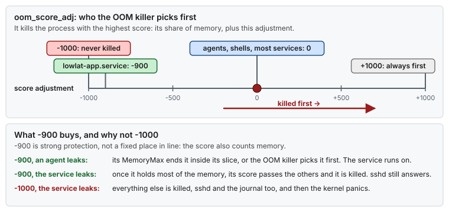
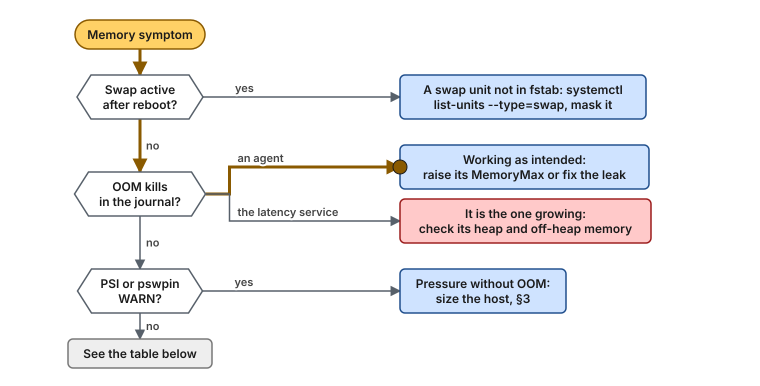

# Guide 12 — Memory Pressure: Swap, mlock and the OOM Killer

> **Script:** [`scripts/12-memory-pressure`](../scripts/12-memory-pressure) · **Previous:** [Guide 11 — Day-2 operations](11-day2-operations.md) · **Concepts:** [swap and the OOM killer](../concepts/swap-and-oom.md), [memory reclaim and faults](../concepts/memory-reclaim.md) · **Story:** [Use case 17](../examples/use-cases/17-memory-pressure-on-a-latency-host.md) · **Terms:** [Glossary](../GLOSSARY.md)

| | |
|---|---|
| **Risk level** | **3 / 5**. Turning swap off moves every swapped page back into RAM, and a host sized too tightly then meets the OOM killer sooner. The script refuses when the swapped pages do not fit. |
| **Reboot required** | No. Swap goes off at once, and the fstab change keeps it off at the next boot. |
| **Applies to** | Bare metal and VMs |
| **Depends on** | [Guide 05](05-cgroup-isolation.md) (memory caps on the agents), [Guide 06](06-kernel-sysctl-tuning.md) (watermarks and dirty limits), [Guide 07](07-os-hygiene.md) (limits for login sessions) |
| **Time** | 20 min, plus a restart of the latency services |

## At a glance

- **What:** decide what happens when memory runs out. Turn swap off (or keep it away from the latency services), make the OOM killer take the agents first and the latency service last, give the services a memlock limit that `mlockall` can use, and watch memory pressure.
- **Why:** with swap, a leak in any process turns into millisecond swap-in stalls in the critical threads, hours later, with nothing logged. Without swap, it ends in one logged kill of the process that leaked.
- **Cost:** no safety net of disk-backed memory. The host must be sized for its peak, and the agents must be capped.

**Time:** 20 min · **Do this if:** the host runs a latency-critical service · **Skip if:** the host is shared with workloads that rely on swap, and you cannot cap them.



*Memory exhaustion ends in one of three places. This guide, with the caps of Guide 05, makes it end in the first two: a logged kill, in an order you chose.*

---

## 1. Why memory pressure needs a policy

A RHEL installation creates a swap volume, and nothing in Guides 00 to 11 changes that. Most of the time it does not matter: the host has memory to spare, and swap stays empty. It matters on the day something grows: an agent leaks, a log shipper buffers a backlog, a batch job runs on the wrong host. Then the kernel has two ways to find memory for anonymous pages:

| | With swap | Without swap |
|---|---|---|
| What the kernel does | Writes cold anonymous pages to disk, from **every** process, latency service included | Kills one process, the one with the highest OOM score |
| What the latency service sees | Major faults on pages it touches again: 0.1 ms to many ms each, for hours | Nothing, unless it is the one chosen |
| What the logs show | Nothing | `Out of memory: Killed process … (name)` |
| How it ends | When the pressure goes and every swapped page has been touched again | At once |


*With swap, a leak in one agent becomes slow, silent stalls in every process. Without it, the leak ends in one logged kill, and the latency service never notices.*

> **Picture it.** Swap is a storeroom across the street. When the office is full, the clerk moves boxes there, including yours, and every time you need one you wait for someone to walk over and back. Without the storeroom, the manager asks the person who brought too many boxes to leave.

The [swap and OOM concept](../concepts/swap-and-oom.md#6-silent-stalls-versus-a-loud-failure) explains the mechanism. This guide applies the policy: **fail loudly, and choose who fails.**

## 2. When to apply, and when not

| Host | Recommendation |
|---|---|
| Dedicated latency host, agents capped by [Guide 05](05-cgroup-isolation.md) | `SWAP_POLICY=off` |
| Latency host that also runs batch work you cannot cap | `SWAP_POLICY=protect`: the host keeps swap, the latency services never use it |
| A VM without swap (most cloud images) | Apply anyway: it sets the OOM order, the memlock limit and the pressure checks |
| Development box or laptop | Skip |

> [!NOTE]
> **Validate on your hardware.** "No swap" is the common choice for dedicated latency hosts, and it follows the "fail loudly" rule of this repository. It also makes a global OOM more likely on a host that is sized too tightly. Size the host first (§3), and watch `MemAvailable` and memory pressure ([PSI](../GLOSSARY.md#psi)) for a week before you turn swap off on a host that uses it today.

## 3. Before you start: is there room?

```bash
free -m                                            # Mem: available; Swap: used
swapon --show                                      # active swap devices (empty: none)
grep -E '^(MemTotal|MemAvailable|SwapTotal|SwapFree|HugePages_Total|Hugepagesize):' /proc/meminfo
for p in /proc/[0-9]*; do awk -v p="${p##*/}" '/^Name:/ {n = $2} /^VmSwap:/ && $2 > 0 {print $2, "kB", n, p}' "$p/status" 2>/dev/null; done | sort -rn | head
# who is on swap now: these pages come back into RAM when swap goes off
```

The memory a latency host needs at its peak is roughly:

```text
hugetlb pool (Guide 03)
+ anonymous memory of the latency services outside the pool (stacks, metaspace, code cache, direct buffers)
+ the agents' caps (MemoryMax of housekeeping.slice, Guide 05)
+ the page cache the host needs to stay fast (journals, logs, the application's files)
+ vm.min_free_kbytes (Guide 06)
+ a margin for what you forgot
```

If `MemAvailable` at the busiest hour of the week does not leave that margin, add memory or cap more before you turn swap off.

## 4. The settings

### 4.1 Swap off (`SWAP_POLICY=off`)

| Step | What it does | Why |
|---|---|---|
| Precheck | Refuses when swap in use ≥ `MemAvailable` | `swapoff` reads every swapped page back. If they do not fit, the host meets the OOM killer during the change. |
| `swapoff -a` | Deactivates every swap device now | No more swap-out from now on |
| fstab | Comments out every `swap` line, with the marker `# disabled by mechanical-sympathy 12-memory-pressure:` | systemd activates the swap lines of fstab at boot. Commented, they stay off. |
| zram | Masks `systemd-zram-setup@zram0.service` when it exists | A compressed RAM swap would come back at boot |
| `91-lowlat-memory.conf` | Removed if an earlier `protect` apply wrote it | `swappiness` does not matter without swap |

```bash
swapon --show                       # empty
grep -E '^\S+\s+\S+\s+swap' /etc/fstab || echo "no active swap line"
```

The `resume=` and `rd.lvm.lv=…/swap` arguments on the kernel command line stay. They only name the volume for hibernation and for the initramfs, and do not activate it.

### 4.2 Swap kept, latency services protected (`SWAP_POLICY=protect`)

| Setting | Value | Why |
|---|---|---|
| `vm.swappiness` in `/etc/sysctl.d/91-lowlat-memory.conf` | `1` | Drop page cache long before swapping anonymous memory. It is a preference, not a guarantee ([concept §3](../concepts/swap-and-oom.md#3-what-vmswappiness-really-means)). |
| `MemorySwapMax=0` on each latency unit (cgroup v2) | in the drop-in of §4.4 | The guarantee: the service's pages never go to swap |

On cgroup v1 (RHEL 8 by default), `MemorySwapMax=` does not exist. There, `mlockall` in the application (§4.5) is what keeps its pages out of swap.

### 4.3 zswap off

zswap compresses pages in RAM before they go to the swap device. RHEL ships it off. The script turns it off if something turned it on (`/sys/module/zswap/parameters/enabled` = `N`), and `lowlat-runtime.service` repeats that at every boot, because it is a runtime setting.

### 4.4 The OOM order: `OOMScoreAdjust=`

For every unit in `LATENCY_UNITS`, the script writes `/etc/systemd/system/<unit>.d/20-lowlat-memory.conf`:

```ini
[Service]
OOMScoreAdjust=-900
LimitMEMLOCK=infinity
MemorySwapMax=0          # cgroup v2 only
```

| Value | Effect |
|---|---|
| `OOMScoreAdjust=-900` | Strong protection: the score is the process's share of memory plus this adjustment, so the kernel picks almost any other process first, unless this one holds most of the memory |
| Not `-1000` | `-1000` makes the service unkillable. If the service itself leaks, the kernel kills everything else (agents, `sshd`, the journal) and then panics. `-900` keeps it last while the host stays reachable. |



*The OOM killer takes the highest score: memory share plus adjustment. At -900 the latency service is chosen only when it holds most of the memory, which is when it is the one leaking, and the host survives. At -1000 it can never be chosen, and it takes the host down with it.*

The agents need no positive score when they are capped: their own `MemoryMax=` in [Guide 05](05-cgroup-isolation.md#4-design-three-slices) ends a leak inside their slice before the host runs out. [Guide 05](05-cgroup-isolation.md#4-design-three-slices) already shows `lowlat-app.service` with `OOMScoreAdjust=-900` and `LimitMEMLOCK=infinity`. This guide writes both, plus `MemorySwapMax=0` on cgroup v2, as a drop-in for every unit you list.

```bash
systemctl show -p OOMScoreAdjust,LimitMEMLOCK,MemorySwapMax lowlat-app.service
cat /proc/$(systemctl show -p MainPID --value lowlat-app.service)/oom_score_adj     # -900
```

### 4.5 The memlock limit: why `limits.d` is not enough

[Guide 07 §3](07-os-hygiene.md#3-resource-limits) sets `memlock unlimited` for `app-user` in `/etc/security/limits.d/`. Those files are read by **PAM** when a user logs in. A systemd service does not log in, so it gets the default limit (64 KiB to 8 MiB, depending on the kernel and systemd version), and `mlockall(MCL_CURRENT | MCL_FUTURE)` fails or locks only part of the process. `LimitMEMLOCK=infinity` in the unit is what reaches the service.

```bash
grep -E '^(VmLck|VmRSS|VmSwap):' /proc/$(systemctl show -p MainPID --value lowlat-app.service)/status
# VmLck close to VmRSS: mlockall worked; VmSwap: 0 kB
```

Pages locked with `mlockall`, and pages in the hugetlb pool, are never swapped and never evicted, which also keeps the service's code out of the major faults of [memory reclaim §7](../concepts/memory-reclaim.md#7-faults-what-a-missing-page-costs).


*The same read costs nothing on a locked, pre-touched page, about a microsecond on a minor fault, and up to milliseconds on a major fault from swap.*

### 4.6 Watching pressure

`verify-tuning` (and so the daily timer of [Guide 11](11-day2-operations.md#2-the-verification-timer)) reports two signals:

| Check | Source | Level | Meaning of a WARN |
|---|---|---|---|
| `pswpin = 0` | `/proc/vmstat` | WARN | A page was read back from swap since boot: some process stalled on it |
| PSI `full avg300 ≤ MEMORY_PSI_FULL_AVG300_MAX` | `/proc/pressure/memory` | WARN | For that share of the last 5 minutes, every task waited for memory |

The default threshold (`1.00` %) is illustrative: set it from a week of your own baseline. RHEL 8 builds PSI in but turns it off. Add `psi=1` to the kernel command line to get it; until then the check only prints a note.

## 5. Using the script

```bash
scripts/12-memory-pressure --dry-run            # every command and file, nothing changed
sudo scripts/12-memory-pressure --apply         # apply the policy now
scripts/12-memory-pressure --verify             # the checks of §6
sudo scripts/12-memory-pressure --rollback      # swap back on, drop-ins and settings removed
```

| `lowlat.conf` key | Default | Meaning |
|---|---|---|
| `SWAP_POLICY` | `off` | `off` or `protect` (§4.1, §4.2) |
| `LATENCY_UNITS` | `(lowlat-app.service)` in the example, empty if absent | The latency-critical services. Empty: a WARN, and no drop-ins |
| `LATENCY_OOM_SCORE_ADJ` | `-900` | −1000 to 1000 (§4.4) |
| `MEMORY_PSI_FULL_AVG300_MAX` | `1.00` | WARN threshold in percent (§4.6) |

`apply-all --apply` runs this guide after Guide 07, and `apply-all --runtime` turns zswap off at every boot. The drop-ins take effect when the services restart.

## 6. Verification

```bash
scripts/12-memory-pressure --verify
#   PASS no active swap device (SWAP_POLICY=off)
#   PASS no active swap line in /etc/fstab
#   PASS zswap is off
#   PASS lowlat-app.service: 20-lowlat-memory.conf drop-in exists
#   PASS lowlat-app.service: OOMScoreAdjust=-900
#   PASS lowlat-app.service: LimitMEMLOCK=infinity
#   PASS lowlat-app.service: no memory on swap (VmSwap of pid …)
#   PASS no page swapped in since boot (pswpin = 0)
#   PASS memory pressure: PSI full avg300 <= 1.00 %
swapon --show                                     # empty with SWAP_POLICY=off
cat /proc/pressure/memory                         # some/full avg10, avg60, avg300 near 0
journalctl -k | grep -i 'out of memory'           # empty, or the agents you expect
```

## 7. Troubleshooting



*Start from what the host shows: swap that came back, a kill, or pressure without a kill. Each branch ends at a fix.*

| Symptom | Cause | Fix |
|---|---|---|
| `--apply` exits 3: "swap in use … does not fit" | More is swapped out than RAM can take back | Free memory (restart the process with the largest `VmSwap`), or use `SWAP_POLICY=protect` |
| Swap is active again after a reboot | A swap unit that is not in fstab: `systemd-gpt-auto-generator` for a GPT swap partition, or zram from a package | `systemctl list-units --type=swap`, then `systemctl mask <unit>` |
| `mlockall` fails with `ENOMEM` or locks little | The service has the default memlock limit | Check `systemctl show -p LimitMEMLOCK <unit>`; restart it after `--apply` |
| The latency service was OOM-killed | It had the highest score: it is the one that grew | Its own memory, not the policy: heap, direct buffers, a cache without a bound |
| An agent is OOM-killed repeatedly | `MemoryMax` of its slice is below its real need | Raise it for that unit ([Guide 05 §7](05-cgroup-isolation.md#7-troubleshooting)) |
| The PSI check only prints a note on RHEL 8 | PSI is built in but off | `psi=1` on the kernel command line |
| `--verify` reports FAIL for OOMScoreAdjust although the drop-in exists | The unit was not reloaded, or another drop-in later in the order overrides it | `systemctl daemon-reload`; `systemctl cat <unit>` shows every drop-in in order |

## 8. Rollback

- [ ] Run `sudo scripts/12-memory-pressure --rollback`: it removes the drop-ins and `91-lowlat-memory.conf`, restores `vm.swappiness` and zswap, un-comments only the swap lines it commented out, unmasks zram swap if it masked it, and runs `swapon -a`
- [ ] Restart the latency services, so that they drop the OOM score and the memlock limit
- [ ] Set `SWAP_POLICY=protect`, or remove the units from `LATENCY_UNITS`, so that `apply-all` does not apply it again
- [ ] Confirm: `swapon --show` lists the swap device again, and `systemctl show -p OOMScoreAdjust <unit>` prints `0`

## 9. Bare metal vs VM

| | Bare metal | VM |
|---|---|---|
| Swap off | ✅ | ✅ Most cloud images have no swap: nothing to do |
| OOM order, memlock limit | ✅ | ✅ |
| zswap off | ✅ | ✅ |
| PSI and `pswpin` checks | ✅ | ✅ They see the guest's pressure. A host that overcommits memory can still swap the guest's pages behind its back (ballooning, host swap): ask the hypervisor owner |

## 10. Key takeaways

- **Choose how memory exhaustion ends.** Without a policy, it ends in silent swap-in stalls spread over every process.
- **No swap, capped agents, and an OOM order** make it end in one logged kill of the process that grew.
- **`-900`, not `-1000`,** keeps the latency service last without making the host unreachable when the service itself leaks.
- **`limits.d` does not reach services.** `LimitMEMLOCK=infinity` in the unit is what lets `mlockall` work.
- **Watch `pswpin` and PSI.** The daily verification turns pressure into a WARN before it turns into a stall.

## 11. References

- [Concept: swap and the OOM killer](../concepts/swap-and-oom.md), [Concept: memory reclaim and faults](../concepts/memory-reclaim.md)
- `man 8 swapon`, `man 5 fstab`, `man 5 systemd.exec` (`OOMScoreAdjust=`, `LimitMEMLOCK=`), `man 5 systemd.resource-control` (`MemorySwapMax=`), `man 8 systemd-gpt-auto-generator`
- <https://docs.kernel.org/admin-guide/sysctl/vm.html>
- <https://docs.kernel.org/accounting/psi.html>
- <https://docs.kernel.org/admin-guide/mm/zswap.html>
